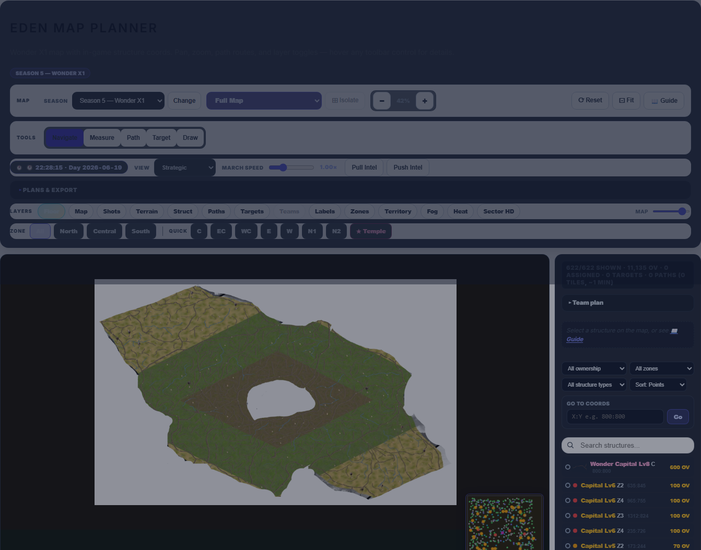
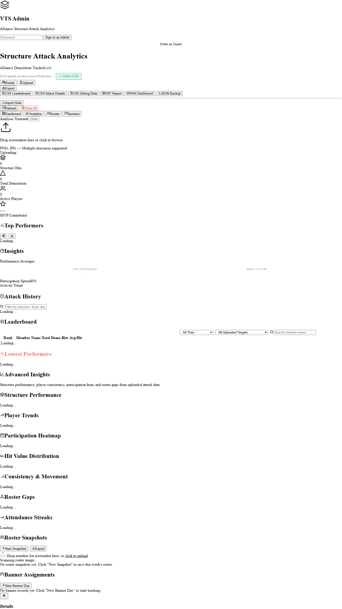
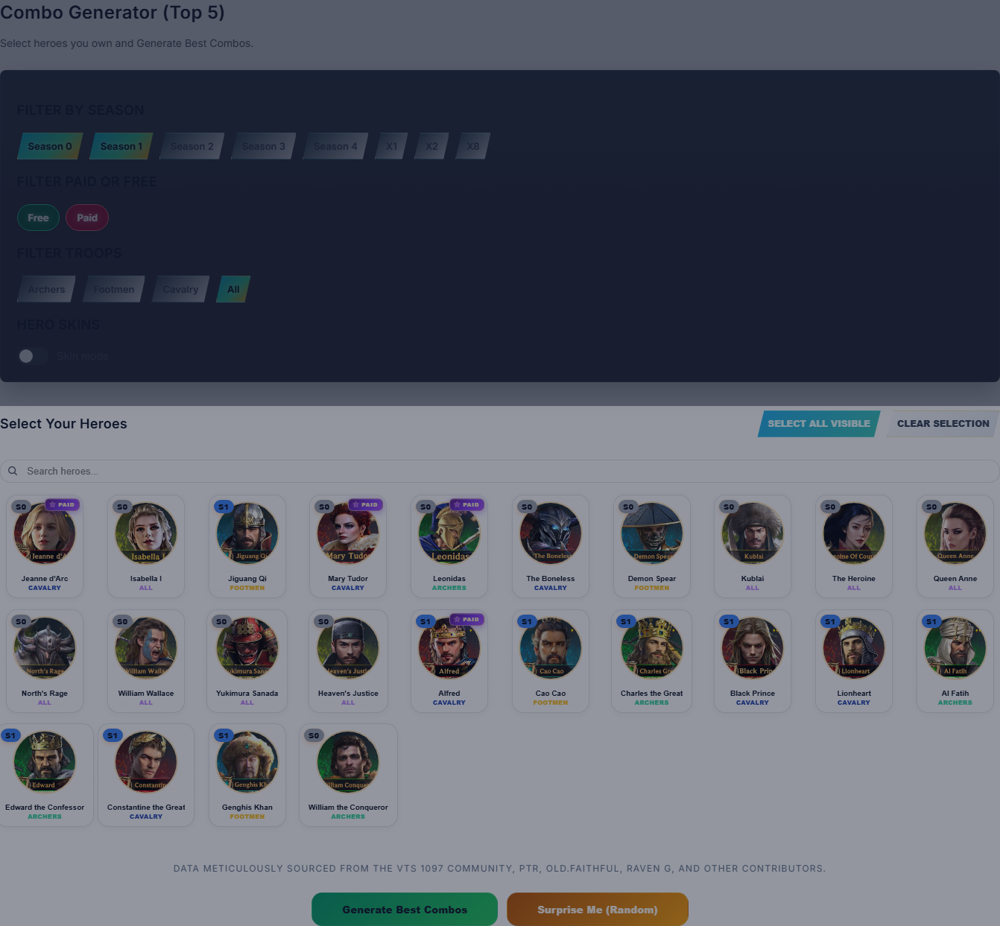

# Hero Combo Creator — VTS 1097 (v9.2.2)

A comprehensive community toolkit for **Rise of Castles: Ice & Fire**, built for VTS State 1097. Combines hero combo building, Eden map planning, tech research tracking, loyalty math, OCR attack analysis, and roster management — all in a single-page web app.

## Features

| Feature | Description |
|---------|-------------|
| **Manual Builder** | Drag-and-drop 3-hero combos, save to Firebase, export as image/text |
| **Combo Generator** | Select ≥12 owned heroes → generates top-5 ranked combos without overlap; "Surprise Me" random mode |
| **Combo Counters** | Expandable counter matchups with hero portraits, ranks/scores, and optional notes |
| **Hero Atlas** | Searchable database of 68+ heroes — skills, synergies, top combos, seasonal filters, adjustable bonuses |
| **Skin System** | Toggle "Heroes with skins" to sort/badge skinned heroes; skin details in Hero Atlas (bio attributes, inheriting skill, Hidden Power) |
| **Eden Map Planner** | Canvas-based 1700×1600 tile map with scout mode, route planning, layer toggles, team plans (up to 4 teams), terrain-aware distance |
| **Tech Research Calculator** | Full Academy tracker across S0–X2 seasons, game-layout trees, War Badge/Courage Medal global summary |
| **Eden Loyalty Calculator** | Poison mitigation, camp presets, deficit/surplus calculations |
| **VTS Admin Dashboard** | OCR attack report analysis (Qwen VL API), leaderboard, trend charts, CSV/PNG/JSON exports |
| **VTS Admin Roster** | Screenshot-based roster extraction, alliance assignment, trusted/spy/unknown status, snapshot history with auto-diff |
| **Banner Tracking** | Weekly banner day team assignments persisted in localStorage |
| **YouTube** | Lazy-loaded VTS 1097 playlists |
| **Comments** | Threaded community feedback via Firebase Firestore |
| **i18n** | 11 languages (English, Español, Português, Deutsch, Français, Türkçe, Русский, Indonesia, 中文, العربية, 한국어) |
| **Sharing** | Share combos and rosters via URL; export combos as image (html2canvas) |
| **PWA** | Service worker registration, standalone display mode, themed splash screen |

## Screenshots And Demos

Current screenshot captures live in `docs/media/` and should be refreshed when a major UI flow changes.

| Area | Preview |
|------|---------|
| Eden Map Planner |  |
| OCR Admin Entry |  |
| Combo Generator |  |

Short GIFs are welcome for workflows that static screenshots cannot show well, especially OCR upload parsing and Eden route planning. Keep media optimized before committing so the GitHub Pages branch stays light.

## Quick Start

```bash
npm install
npm run dev      # Vite dev server (hot-reload)
npm run build    # Production build → dist/ + docs/
npm run preview  # Preview production build
npx serve .      # Static serve from root (no build)
```

## Tech Stack

| Layer | Choice |
|-------|--------|
| **Language** | Vanilla JavaScript (ES6 modules), no framework |
| **Bundler** | Vite 6 (dev server + build) |
| **CSS** | Custom `app.css` + Tailwind CSS (via CDN at runtime) |
| **Backend** | Firebase Firestore (comments, combos, roster sync) |
| **Auth** | Firebase anonymous auth |
| **OCR** | Qwen VL API via Cloudflare Worker proxy |
| **Maps** | HTML Canvas (Eden Map) |
| **Export** | html2canvas (image), CSV, JSON |
| **Hosting** | GitHub Pages (gh-pages branch, root-level serving) |

## File Structure

```
index.html              Main SPA shell (~650 lines, 54KB after tab extraction)
postcss.config.js       PostCSS + Tailwind + cssnano config
tailwind.config.js      Tailwind config (preflight disabled)
vite.config.js          Vite build config (manual chunking)
scripts/post-build.mjs  Post-build: copy assets to dist/ + docs/
public/
  sw.js                 Service worker
  404.html              404 fallback page
workers/
  qwen-cors-proxy.js    Cloudflare Worker: Qwen API proxy
tabs/
  admin.html            VTS Admin tab template (lazy-loaded)
  eden-map.html         Eden Map tab template (lazy-loaded)
  loyalty.html          Eden Loyalty tab template (lazy-loaded)
database/
  build-eden-datasets.py  Generate encoded Eden dataset payload
  build-eden-from-screenshots.py  Rebuild X1 dataset from screenshots
  build-eden-x12.py      Rebuild X12 reference dataset
  (and more Python tools for Eden data)

css/
  app.css               All styles (~6100 lines)
  mobile.css            Mobile responsive overrides

js/
  app.js                Core: tabs, theme, event wiring, error boundaries
  app-builder.js        Manual combo builder: drag-drop, slots, save
  app-generator.js      Combo generator: best & random modes
  app-hero-atlas.js     Hero Atlas tab: search, skills, synergies, skins
  app-research.js       Tech Research Calculator tab
  app-export.js         Export functions (html2canvas, CSV, text)
  app-hero-tooltip.js   Hero tooltip hover logic
  app-loading.js        Boot splash (3D door animation), loading progress

  state.js              Shared state: combo rank info, filters, troop colors
  utils.js              escapeHtml, helpers
  seo.js                JSON-LD schema, meta optimization

  skins-db.js           Skin database schema + hero skin entries
  combos-db.js          Ranked combo database (180 entries)
  combo-counters.js     Counter matchups + render
  combo-counter-lookup.js  Search: which heroes counter which
  combo-share.js        URL share for combos
  roster-share.js       URL share for rosters
  comments.js           Firestore snapshot comments (threaded)

  heroes-data.js        Hero base data (68 heroes: name, season, troop, state)
  heroes-info.js        Hero skills, placement, copies
  hero-bonuses.js       Manual rating adjustments

  firebase.js           Firebase init, anonymous auth, getDb
  player-profile.js     Cloud profile save/load
  pwa-register.js       Service worker registration + install prompt
  game-time.js          Game clock display, sync titles
  translations.js       i18n string tables (11 languages)

  tech-db.js            Tech tree database
  research-node-icons.js    SVG icons for tech nodes
  research-advanced.js  Advanced research view
  loyalty-calculator.js Eden loyalty calculator

  ocr-dashboard.js      VTS Admin: main dashboard logic
  ocr-roster.js         Roster: checklist, login, alliances, snapshots
  ocr-render.js         Dashboard UI rendering
  ocr-engine.js         OCR parsing logic (structure names, durability)
  ocr-shared.js         Shared constants, state, helpers for OCR module

  eden-map.js           Eden Map: render, plans, routing
  eden-map-data.js      Static data, sector definitions
  eden-map-assets.js    Image preloading, icon management
  eden-map-terrain.js   Terrain layer, pathfinding
  eden-map-ui.js        UI controls, toolbars
  eden-map-features.js  Structure features, filters
  eden-map-guide.js     Help overlay
  eden-map-season.js    Season picker
  eden-map-teams.js     Team management
  eden-map-scout.js     Scout report overlay
  eden-map-construction.js  Construction timeline
  eden-map-config.js    Constants
  eden-datasets.payload.js  Base64-encoded Eden structure datasets
  eden-datasets-loader.js   Runtime decoder
  eden-live-map.js      Live map overlay
  eden-tooltips.js      Eden hover tooltips (i18n)
```

## Key Architecture Decisions

### Deployment Model
GitHub Pages serves from the **root** of the `gh-pages` branch. Source files (`index.html`, `js/`, `css/`) are served directly. The `dist/` and `docs/` folders are build artifacts for alternative hosting.

### Tailwind CSS
Tailwind is loaded via CDN at runtime (`cdn.tailwindcss.com`). The `postcss.config.js` + `tailwind.config.js` files enable Vite dev-server processing. `preflight: false` avoids conflicts with `app.css` reset styles. `cssnano` is used in production.

### Tab Lazy-Loading
Three heavy tab templates (Admin 25KB, Eden Map 23KB, Loyalty 17KB) were extracted from `index.html` into `tabs/` and fetched on first tab click via `loadTabTemplate()`. This reduced `index.html` from 120KB → 54KB (-55%).

### Error Boundaries
Each module init is wrapped in `safeInit()` so one failing tab doesn't block others. Global `error` and `unhandledrejection` handlers catch last-resort failures. A 5-second loading screen timeout force-dismisses the splash if `notifyAppReady` never fires.

### State Management
Shared state variables (`allHeroesData`, `heroesExtendedData`, `rankedCombos`, etc.) are exported from their respective modules. The `state.js` module provides computed helpers (`getComboRankInfo`, troop color maps, filter logic).

### OCR Module Pattern
The legacy monolithic `ocr-dashboard.js` was split into `ocr-roster.js`, `ocr-render.js`, `ocr-engine.js` with a shared `ocr-shared.js` for constants, state, and utilities (`$id`, `esc`, `log`).

## Data Flow

```
1. Combo Builder
   Select 3 heroes → updateManualComboScore() → getComboRankInfo() → show rank + score + counters

2. Combo Generator
   Select ≥12 heroes → generateBestCombos() → iterate rankedCombos → top 5 (no overlap)

3. OCR Roster
   Upload screenshot → Qwen API → takeRosterSnapshot() → localStorage + Firestore → renderRoster()

4. OCR Attack Data
   Upload structure screenshots → Qwen API → save to dashData → leaderboard + chart + insights

5. Eden Map
   Select season → render map → place/remove structures → plan routes → share plan
```

## localStorage Keys

| Key | Purpose |
|-----|---------|
| `vts_ocr_dashboard` | Attack data JSON |
| `vts_ocr_auth` | Admin password hash |
| `vts_ocr_roster` | Legacy flat roster text |
| `vts_roster_snapshots` | Roster snapshot array |
| `vts_roster_alliances` | Alliance name list |
| `vts_roster_user` | Logged-in roster user |
| `vts_ocr_banners` | Banner records array |
| `qwen_api_key` | Qwen API key (user-set) |

## Firebase

- **Auth:** Anonymous via `ensureAnonymousAuth()`
- **Firestore paths:**
  - `vts_admin/dashboard_data` — OCR attack data
  - `vts_admin/roster_data` — roster snapshots
  - `vts_saved_combos` — community shared combos
- **Real-time listeners** via `onSnapshot()` for roster and comments
- **Offline-first:** All saves go to localStorage first, then Firestore

## Deploy

```bash
git push origin gh-pages
```

The site auto-deploys at **https://roc-vts.com/** (custom domain configured in repo Settings → Pages).

## Contributing

Community data updates are welcome. See [CONTRIBUTING.md](CONTRIBUTING.md) for the preferred formats for hero stats, combo corrections, skin data, OCR examples, and Eden screenshots.

For release bookkeeping, keep [CHANGELOG.md](CHANGELOG.md) and [VERSIONING.md](VERSIONING.md) updated with every user-visible change.

Internal project notes for maintainers and AI agents live in [docs/dev/](docs/dev/README.md).

## Eden Map Data

Dataset JSON is stored encoded in `js/eden-datasets.payload.js`. After updating screenshots or map assets:

```bash
python database/build-eden-from-screenshots.py   # X1 from in-game screenshots
python database/build-eden-x12.py                # X12 reference baseline
```

Both run `build-eden-datasets.py` to regenerate the payload. Then `npm run build` to rebuild.

## Environment

- Node.js 18+ (for Vite build)
- Python 3.10+ (for Eden dataset scripts)
- A Qwen API key (for OCR features — set in VTS Admin → API Settings)
