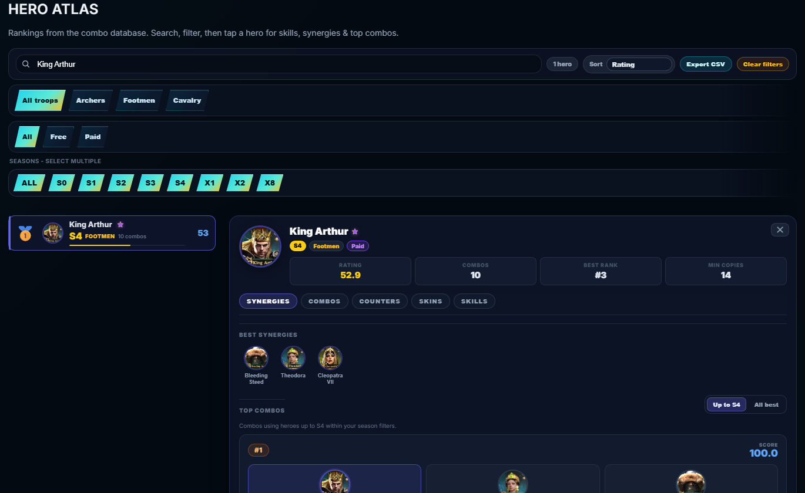

# Hero Combo Creator - VTS 1097 (v12.1.1)

A comprehensive community toolkit for **Rise of Castles: Ice & Fire**, built for VTS State 1097. Combines hero combo building, Eden map planning, tech research tracking, loyalty math, OCR attack analysis, and roster management -- all in a single-page web app.

## Features

| Feature | Description |
|---------|-------------|
| **Manual Builder** | Drag-and-drop 3-hero combos, save to Firebase, export as image/text |
| **Combo Generator** | Select 12+ owned heroes -> generates top-5 ranked combos without overlap; "Surprise Me" random mode |
| **Combo Counters** | Expandable counter matchups with hero portraits, ranks/scores, and optional notes |
| **Hero Atlas** | Searchable database of 68+ heroes -- skills, synergies, top combos, seasonal filters, adjustable bonuses |
| **Skin System** | Toggle "Heroes with skins" to sort/badge owned skins; skin records include pending-detail placeholders, portrait icons, type colors, and combo references |
| **Eden Map Planner** | Canvas-based 1700x1600 tile map with scout mode, route planning, layer toggles, team plans (up to 4 teams), terrain-aware distance |
| **Tech Research Calculator** | Full Academy tracker across S0-X2 seasons, game-layout trees, War Badge/Courage Medal global summary |
| **Eden Loyalty Calculator** | Poison mitigation, camp presets, deficit/surplus calculations |
| **Seasonal VTS Admin** | Eden-season OCR attack report analysis (Qwen VL API), dedicated structure upload tab, contribution reward lists, leaderboard, trend charts, R5 Conduct Adjustments, CSV/PNG/JSON exports |
| **Seasonal Roster Ops** | Screenshot-based roster extraction, alliance assignment, trusted/spy/unknown status, snapshot history with auto-diff |
| **Duty List Tracking** | Banner, Pather, and Shield Wall lists with roster-name suggestions, nickname confirmation, and local history |
| **YouTube** | Lazy-loaded VTS 1097 playlists |
| **Comments** | Threaded community feedback via Firebase Firestore |
| **Atmosphere Layer** | CSS utility-first design system — press, lift, tilt, skeleton, morph, burst, aura, counter, and connector animations for a polished dark-first UI |
| **i18n** | 11 languages (English, Espanol, Portugues, Deutsch, Francais, Turkce, Russian, Indonesia, Chinese, Arabic, Korean) |
| **Sharing** | Share combos and rosters via URL; export combos as image (html2canvas) |
| **PWA** | Service worker registration, standalone display mode, hashed cache-busted assets, dev-mode SW unregister guard |
| **v12 Command UI** | Unified dark-first tactical interface across all tools, admin panels, filters, cards, tables, and light-theme states |

## Screenshots And Demos

Current screenshot captures live in `docs/media/` and should be refreshed when a major UI flow changes. These previews are captured in dark mode from the local app with demo data where needed.

<table>
  <tr>
    <td width="50%">
      <strong>Combo Generator</strong><br>
      
    </td>
    <td width="50%">
      <strong>Hero Atlas</strong><br>
      
    </td>
  </tr>
  <tr>
    <td width="50%">
      <strong>Eden Map Planner</strong><br>
      
    </td>
    <td width="50%">
      <strong>VTS Admin Dashboard</strong><br>
      
    </td>
  </tr>
</table>

Short GIFs are welcome for workflows that static screenshots cannot show well, especially OCR upload parsing and Eden route planning. Keep media optimized before committing so the GitHub Pages branch stays light.

## Quick Start

```bash
npm install
npm run dev      # Vite dev server (hot-reload)
npm run build    # Production build -> dist/ + docs/
npm run preview  # Preview production build
npx serve .      # Static serve from root (no build)
```

## Release Checks

Run the full local gate before shipping:

```bash
npm run check
```

That runs lint, Prettier check, unit tests, i18n validation, production build, bundle-size check, and Playwright smoke tests. The 12.1.1 release should pass the full local gate before shipping.

Version cadence: after the 11.3.0 baseline, every pushed release increments the patch slot through `11.3.19`; the next release after that becomes `11.4.0`. The same 20-release cycle repeats for future minor versions.

## Tech Stack

| Layer | Choice |
|-------|--------|
| **Language** | Vanilla JavaScript (ES6 modules), no framework |
| **Bundler** | Vite 6 (dev server + build) |
| **CSS** | Custom `app.css`, responsive `mobile.css`, `atmosphere.css` (press/lift/tilt/skeleton/morph utility classes), `components.css`, frozen local utility compatibility CSS |
| **Backend** | Firebase Firestore loaded through pinned browser modules (comments, combos, roster sync) |
| **Auth** | Firebase anonymous auth for public tools; Firebase Email/Password admin login with an admin custom claim for dashboard writes |
| **OCR** | Qwen VL API via Cloudflare Worker proxy |
| **Maps** | HTML Canvas (Eden Map) |
| **Export** | html2canvas (image), CSV, JSON |
| **Hosting** | GitHub Pages (gh-pages branch, root-level serving) |

## File Structure

```
index.html              Main SPA shell (~650 lines, 54KB after tab extraction)
vite.config.js          Vite build config (manual chunking)
scripts/post-build.mjs  Post-build: copy assets to dist/ + docs/
public/
  sw.js                 Service worker
  404.html              404 fallback page
workers/
  qwen-cors-proxy.js    Cloudflare Worker: Qwen API proxy
tabs/
  admin.html            VTS Admin tab template (lazy-loaded)
  eden-map.html         Eden Map tab template (lazy-loaded)
  loyalty.html          Eden Loyalty tab template (lazy-loaded)
database/
  eden-datasets.manifest.json  Eden dataset catalog
  Eden_*.txt                   Source map datasets
  eden-wonders-screenshots/    Extracted sector data
scripts/eden/
  build-eden-datasets.py       Generate encoded Eden dataset payload
  build-eden-from-screenshots.py  Rebuild X1 dataset from screenshots
  build-eden-x12.py            Rebuild X12 reference dataset
  (and more Python tools for Eden data)

css/
  _tokens.css           Shared design tokens, spacing scale, reduced-motion base
  app-utilities.css     Frozen local utility compatibility layer
  app.css               All styles (~6100 lines)
  atmosphere.css        Utility-first design system (press, lift, tilt, skeleton, morph, burst, aura)
  components.css        Reusable component styles (cards, tabs, pills, modals)
  mobile.css            Mobile responsive overrides

js/
  app.js                Core: tabs, theme, event wiring, error boundaries
  app-builder.js        Manual combo builder: drag-drop, slots, save
  app-generator.js      Combo generator: best & random modes
  app-hero-atlas.js     Hero Atlas tab: search, skills, synergies, skins
  app-research.js       Tech Research Calculator tab
  app-export.js         Export functions (html2canvas, CSV, text)
  app-hero-tooltip.js   Hero tooltip hover logic
  app-loading.js        Boot splash (3D door animation), loading progress

  state.js              Shared state: combo rank info, filters, troop colors
  utils.js              escapeHtml, helpers
  seo.js                JSON-LD schema, meta optimization

  skins-db.js           Skin database schema + hero skin entries
  combos-db.js          Ranked combo database (180 entries)
  combo-counters.js     Counter matchups + render
  combo-counter-lookup.js  Search: which heroes counter which
  combo-share.js        URL share for combos
  roster-share.js       URL share for rosters
  comments.js           Firestore snapshot comments (threaded)

  heroes-data.js        Hero base data (68 heroes: name, season, troop, state)
  heroes-info.js        Hero skills, placement, copies
  hero-bonuses.js       Manual rating adjustments

  firebase.js           Firebase init, anonymous auth, getDb
  player-profile.js     Cloud profile save/load
  pwa-register.js       Service worker registration + install prompt
  game-time.js          Game clock display, sync titles
  translations.js       Default English i18n loader + dynamic language imports
  i18n/                 Per-language modules loaded on demand

  tech-db.js            Tech tree database
  research-node-icons.js    SVG icons for tech nodes
  research-advanced.js  Advanced research view
  loyalty-calculator.js Eden loyalty calculator

  ocr-dashboard.js      VTS Admin: main dashboard logic
  ocr-roster.js         Roster: checklist, login, alliances, snapshots
  ocr-render.js         Dashboard UI rendering
  ocr-engine.js         OCR parsing logic (structure names, durability)
  ocr-shared.js         Shared constants, state, helpers for OCR module
  ocr-adjustments.js    R5 Conduct Adjustments panel: merit/penalty points, Firestore sync

  eden-map.js           Eden Map: render, plans, routing
  eden-map-data.js      Static data, sector definitions
  eden-map-assets.js    Image preloading, icon management
  eden-map-terrain.js   Terrain layer, pathfinding
  eden-map-ui.js        UI controls, toolbars
  eden-map-features.js  Structure features, filters
  eden-map-guide.js     Help overlay
  eden-map-season.js    Season picker
  eden-map-teams.js     Team management
  eden-map-scout.js     Scout report overlay
  eden-map-construction.js  Construction timeline
  eden-map-config.js    Constants
  eden-datasets.payload.json  Encoded Eden structure dataset payload
  eden-datasets-loader.js   Runtime decoder
  eden-live-map.js      Live map overlay
  eden-tooltips.js      Eden hover tooltips (i18n)
```

## Key Architecture Decisions

### Deployment Model
GitHub Pages serves from the **root** of the `gh-pages` branch. Source files (`index.html`, `js/`, `css/`) are served directly. The `dist/` and `docs/` folders are build artifacts for alternative hosting.

### CSS Compatibility Layer
The app no longer runs Tailwind during builds. Legacy utility class usage is served by `css/app-utilities.css`, a frozen local compatibility layer copied from the last known-good generated utility output. `cssnano` still minifies production CSS after the Vite build.

### Tab Lazy-Loading
Heavy tab templates (Admin, Eden Map, Loyalty) are fetched on first tab click via `loadTabTemplate()`. Research, Hero Atlas, OCR dashboard, Eden Map code, hero-info data, and language packs are loaded with dynamic `import()` so first paint avoids the biggest optional modules.

### Release Mode
The old maintenance splash/config gate has been removed. `index.html` and `admin.html` load the standard UI directly, and `js/maintenance-config.js` is no longer part of the app or service-worker precache.

### Admin Auth
`js/admin-auth-config.js` gates the admin UI with SHA-256 password hashes. OCR dashboard cloud sync uses Firebase anonymous auth, but writes to the shared `vts_admin` Firestore documents require the Firebase custom claim `admin: true`. Signed-in anonymous users can read the shared dashboard data for guest mode, but they cannot overwrite OCR, roster, banner, pather, or contribution records.

The dashboard saves OCR results to localStorage first, then uploads to Firestore when cloud sync is available. On load, locally cached attacks are merged with cloud attacks by attack id and written back to Firestore, so a day of local-only uploads can be recovered by reopening the same browser profile after rules/config are fixed.

To enable admin cloud writes for a browser profile, copy that user's Firebase Auth UID and run:

```bash
$env:FIREBASE_ADMIN_UID="the-auth-uid"
$env:FIREBASE_SERVICE_ACCOUNT_PATH="C:\path\to\service-account.json"
npm run firebase:admin-claim
```

After setting the claim, reload the site so Firebase refreshes the auth token. If cloud writes still fail, the dashboard should continue using localStorage and show the Firestore error in the admin status/log.

### Firebase
Firebase browser modules are loaded through `js/firebase-sdk.js` from the pinned `gstatic` module version (`11.6.1`) so GitHub Pages can serve raw ES modules without bare package specifiers. If Firebase config is missing, public UI paths degrade gracefully and skip anonymous auth instead of blocking startup.

### OCR Worker and App Check
The admin OCR flow calls Qwen through `workers/qwen-cors-proxy.js`. The browser must be served by Vite or a built deployment with `VITE_FIREBASE_API_KEY`, `VITE_FIREBASE_PROJECT_ID`, `VITE_FIREBASE_APP_ID`, and `VITE_RECAPTCHA_SITE_KEY`. The reCAPTCHA Enterprise site key is public and is not the App Check token; Firebase uses it in the browser to mint the short-lived token sent as `X-Firebase-AppCheck`.

Worker configuration uses `DASHSCOPE_API_KEY` as a Cloudflare secret. Non-secret Worker variables include `DASHSCOPE_BASE_URL` (default: `https://dashscope-intl.aliyuncs.com/compatible-mode/v1`), `ALLOWED_ORIGINS`, `FIREBASE_APP_CHECK_PROJECT_NUMBER`, and optional `FIREBASE_APP_CHECK_APP_ID`. `FIREBASE_APP_CHECK_APP_ID` is the Firebase Web App ID (`1:...:web:...`), not the reCAPTCHA site key.

For durable Worker-side rate limiting, create a Cloudflare KV namespace and bind it as `RATE_LIMIT_KV` in `wrangler.jsonc`. Without that binding `/status` reports `rateLimitBackend: "memory"`, which is useful locally but not durable across Worker isolates.

Cloudflare Worker deploy checklist:

```bash
npx wrangler login
npm run worker:check
npm run worker:deploy
```

Before deploy, set the Qwen key as a Cloudflare secret:

```bash
npx wrangler secret put DASHSCOPE_API_KEY
```

The checked-in `wrangler.jsonc` is the source of truth for non-secret Worker permissions. It must include `https://roc-vts.com`, `http://localhost:5173`, `http://127.0.0.1:5173`, and any LAN/Vite ports used for phone testing in `ALLOWED_ORIGINS`. Do not deploy with `--keep-vars` when fixing origin drift, because that preserves stale dashboard variables.

For local OCR testing, `.env` may use `VITE_FIREBASE_APPCHECK_DEBUG_TOKEN=true`. The first browser run prints an `App Check debug token`; add that UUID in Firebase Console > App Check > your web app > Manage debug tokens, then replace `true` with the registered UUID and restart Vite. Otherwise Firebase returns HTTP 403 before the OCR Worker receives the request.

If `/status` is ready but uploads fail with `Workers endpoint access denied`, check Cloudflare Worker variables first: `DASHSCOPE_BASE_URL` must be `https://dashscope-intl.aliyuncs.com/compatible-mode/v1`, and `DASHSCOPE_API_KEY` must belong to an Alibaba Cloud account with DashScope/Qwen VL access.

### Error Boundaries
Each module init is wrapped in `safeInit()` so one failing tab doesn't block others. Global `error` and `unhandledrejection` handlers catch last-resort failures. A 5-second loading screen timeout force-dismisses the splash if `notifyAppReady` never fires.

### State Management
Shared state variables (`allHeroesData`, `heroesExtendedData`, `rankedCombos`, etc.) are exported from their respective modules. The `state.js` module provides computed helpers (`getComboRankInfo`, troop color maps, filter logic).

### OCR Module Pattern
The legacy monolithic `ocr-dashboard.js` was split into `ocr-roster.js`, `ocr-render.js`, `ocr-engine.js` with a shared `ocr-shared.js` for constants, state, and utilities (`$id`, `esc`, `log`).

## Data Flow

```
1. Combo Builder
   Select 3 heroes -> updateManualComboScore() -> getComboRankInfo() -> show rank + score + counters

2. Combo Generator
   Select 12+ heroes -> generateBestCombos() -> iterate rankedCombos -> top 5 (no overlap)

3. OCR Roster
   Upload screenshot -> Qwen API -> takeRosterSnapshot() -> localStorage + Firestore -> renderRoster()

4. OCR Attack Data
   Upload structure screenshots -> Qwen API -> save to dashData -> leaderboard + chart + insights

5. Eden Map
   Select season -> render map -> place/remove structures -> plan routes -> share plan
```

## localStorage Keys

| Key | Purpose |
|-----|---------|
| `vts_ocr_dashboard` | Attack data JSON |
| `vts_ocr_auth` | Admin password hash |
| `vts_ocr_roster` | Legacy flat roster text |
| `vts_roster_snapshots` | Roster snapshot array |
| `vts_roster_alliances` | Alliance name list |
| `vts_roster_user` | Logged-in roster user |
| `vts_ocr_banners` | Banner records array |
| `qwen_api_key` | Legacy browser-stored Qwen key; cleared because OCR now uses the Worker secret |
| `vts_generator_owned_skins_v1` | Per-hero skin/base ownership toggles in the combo generator |

## Firebase

- **Auth:** Anonymous via `ensureAnonymousAuth()`
- **Firestore paths:**
  - `vts_admin/dashboard_data` -- OCR attack data
  - `vts_admin/roster_data` -- roster snapshots
  - `vts_admin/conduct_adjustments/records` -- R5 Conduct Adjustments (admin write only)
  - `vts_saved_combos` -- community shared combos
- **Real-time listeners** via `onSnapshot()` for roster and comments
- **Offline-first:** All saves go to localStorage first, then Firestore

## Deploy

```bash
git push origin gh-pages
```

The site auto-deploys at **https://roc-vts.com/** (custom domain configured in repo Settings > Pages).

## Contributing

Community data updates are welcome. See [CONTRIBUTING.md](CONTRIBUTING.md) for the preferred formats for hero stats, combo corrections, skin data, OCR examples, and Eden screenshots.

### Combo Dataset Attribution

The optional combo audit tool (`npm run combos:audit`) uses public combo candidate data from [tools.riseofcastles.net/combos-data](https://tools.riseofcastles.net/combos-data/). Credit to the Rise of Castles Tools team/community for publishing and maintaining those datasets. Imported records are treated as review candidates and are not automatically merged into the curated ranking database.

For release bookkeeping, keep [CHANGELOG.md](CHANGELOG.md) updated with every user-visible change.

## Eden Map Data

Dataset JSON is stored in `js/eden-datasets.payload.json`. After updating screenshots or map assets:

```bash
python scripts/eden/build-eden-from-screenshots.py   # X1 from in-game screenshots
python scripts/eden/build-eden-x12.py                # X12 reference baseline
```

Both run `build-eden-datasets.py` to regenerate the payload. Then `npm run build` to rebuild.

## Environment

- Node.js 18+ (for Vite build)
- Python 3.10+ (for Eden dataset scripts)
- A Qwen/DashScope API key stored as the Cloudflare Worker secret `DASHSCOPE_API_KEY`
