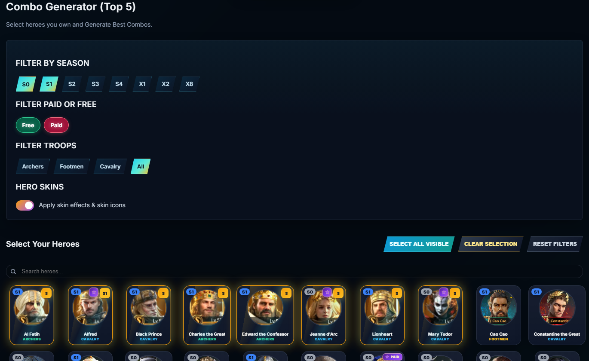
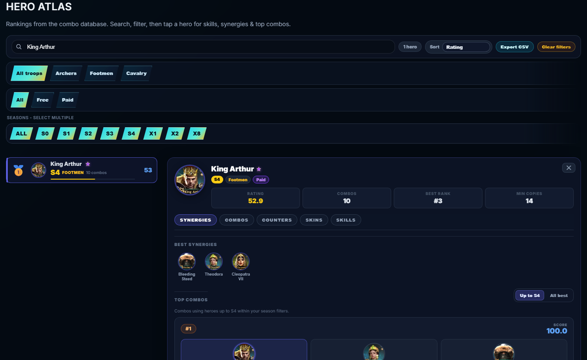
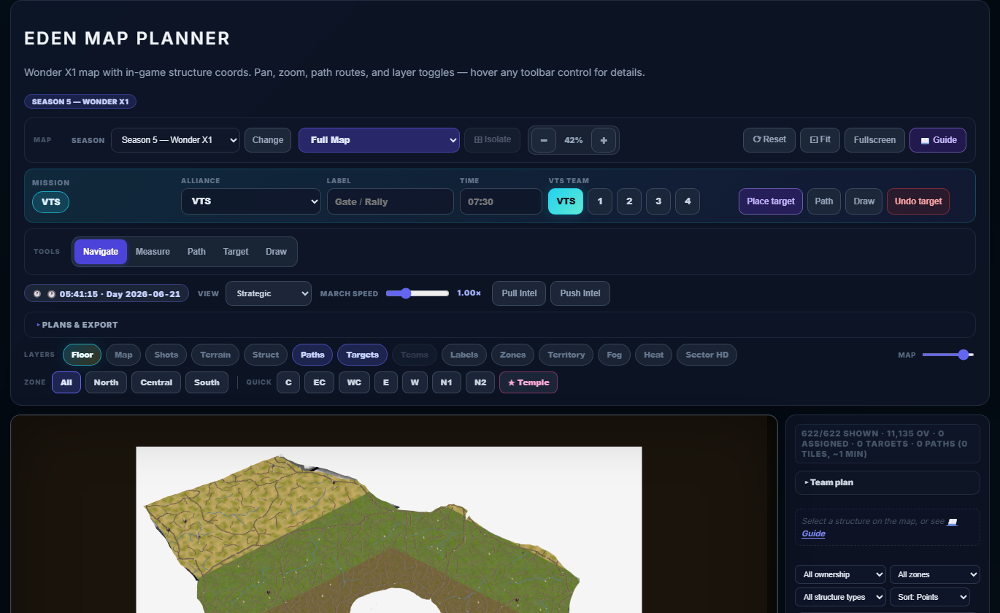
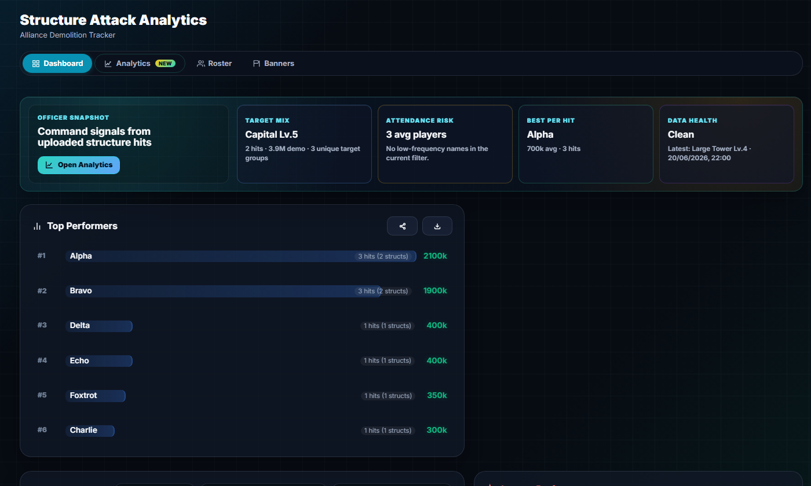

# Hero Combo Creator - VTS 1097 (v13.1.8)

A comprehensive community toolkit for **Rise of Castles: Ice & Fire**, built for VTS State 1097. Combines hero combo building, Eden map planning, Dragon Master material planning, tech research tracking, loyalty math, OCR attack analysis, and roster management -- all in a single-page web app.

## Features

Ten top-level tools are exposed from the main navigation in `index.html`, with `eden-x1.html` kept as a separate public Eden X1 rewards view. This table should stay 1:1 with the deployed UI.

| Tool | Source files | Purpose | Dependencies | Perf notes |
|---|---|---|---|---|
| **Manual Builder** | `js/app-builder.js`, `js/app-export.js`, `js/combos-db.js`, `js/combo-share.js` | Drag-drop 3-hero combos; save to `users/{uid}/bestCombos`; export image/text | Firestore, html2canvas | Save = owner-gated Firestore write |
| **Combo Generator** | `js/app-generator.js`, `js/combos-db.js`, `js/hero-bonuses.js`, `js/combo-counters.js`, `js/skins-db.js`, `js/skin-heroes-data.js` | Select owned heroes -> top-5 ranked combos, no overlap; "Surprise Me" random; skin mode | Hero, combo, counter, and skin datasets | Pure client-side ranking |
| **Hero Atlas** | `js/app-hero-atlas.js`, `js/heroes-info.js`, `js/heroes-data.js`, `js/skins-db.js`, `js/skin-heroes-data.js`, `js/hero-bonuses.js` | 68+ heroes DB; search/filter; skills, synergies, counters, top combos; seasonal filters; adjustable bonuses | Static hero, combo, counter, and skin data | New badge; dynamically imported |
| **Tech Research** | `js/app-research.js`, `js/tech-db.js`, `js/research-buffs.js`, `js/research-advanced.js`, `js/research-node-icons.js` | Academy tracker S0-X8; War Badge/Courage Medal summary; game-layout trees; buff progress | Static research data | `tech-db.js` is data-heavy and split into its own build chunk |
| **DM Materials** | `js/material-calculator.js` | Coming-soon Dragon Master material planner; calculator module is staged but not enabled in the tab yet | Static crafting constants | Tab currently shows a launch placeholder |
| **Eden Map** | `tabs/eden-map.html`, `js/eden-map.js`, `js/eden-map-*.js`, `js/eden-datasets-loader.js`, `database/` | Canvas 1700x1600 tile map; scout mode; route planning; layer toggles; <=4 teams; terrain-aware distance | Static datasets in `database/` | Lazy-loaded tab via `data-tab-src` and dynamic import |
| **Strife over Dragon** | `js/app-strife.js`, `js/strife-db.js`, `js/combos-db.js`, `js/heroes-data.js` | Monster/stage matchup recommendations using local combo and hero data | Static data | New badge; dynamically imported |
| **Eden Loyalty** | `tabs/loyalty.html`, `js/loyalty-calculator.js` | Poison mitigation, camp presets, deficit/surplus | None | Lazy-loaded tab via `data-tab-src` |
| **YouTube** | Inline in `index.html` | 3 VTS 1097 playlists | YouTube IFrame | Lazy-loaded with `IntersectionObserver` (`rootMargin: 200px`) |
| **VTS Admin** | `admin.html`, `tabs/admin.html`, `js/admin-page.js`, `js/ocr-dashboard.js`, `js/ocr-*.js`, `js/contribution-weighting.js` | OCR attack analysis, roster screenshots, contribution lists, leaderboard, CSV/PNG/JSON export, Eden X1 voting, conduct adjustments | Cloudflare Worker (Qwen VL OCR), Firebase Auth/Firestore, reCAPTCHA Enterprise App Check | Seasonal badge; standalone `noindex,nofollow` page |

**Separate view:** `eden-x1.html` uses `js/eden-x1.js`, `css/eden-x1.css`, `js/contribution-weighting.js`, and `js/consistency-score.js` for the public Eden X1 weighted contribution dashboard, reward flow, and team-player vote flow. It is also `noindex,nofollow`.

**Cross-cutting sub-systems:** `comments.js` (Firestore-threaded feedback), `bug-widget.js` + `app-error-reporting.js` (error queue -> `errors` collection), `pwa-register.js` (service worker), `game-time.js` (global game clock), `app-undo.js` (undo toasts), `app-shortcuts.js`, `app-whats-new.js`, `player-tags.js`/`player-registry.js`/`player-profile.js` (roster identity), `roster-share.js`, and `user-data-portability.js` (local data export).

**Performance posture:** Vite build with hashed production assets, manual chunks for large feature/data modules, dynamic `import()` per heavy tab and language pack, preloaded boot wing images and Google Fonts, Google Fonts print-to-all media swap, lazy YouTube iframes, mobile CSS loaded only at `max-width: 768px`, lazy/async footer imagery, `requestIdleCallback` for error flush, `--tap-min: 44px` touch sizing, and `env(safe-area-inset-*)` support for notches.

## Screenshots And Demos

Current screenshot captures live in `docs/media/` and should be refreshed when a major UI flow changes. These previews are captured in dark mode from the local app with demo data where needed.

<table>
  <tr>
    <td width="50%">
      <strong>Combo Generator</strong><br>
      
    </td>
    <td width="50%">
      <strong>Hero Atlas</strong><br>
      
    </td>
  </tr>
  <tr>
    <td width="50%">
      <strong>Eden Map Planner</strong><br>
      
    </td>
    <td width="50%">
      <strong>VTS Admin Dashboard</strong><br>
      
    </td>
  </tr>
</table>

Short GIFs are welcome for workflows that static screenshots cannot show well, especially OCR upload parsing and Eden route planning. Keep media optimized before committing so the GitHub Pages branch stays light.

## Quick Start

```bash
npm install
npm run dev      # Vite dev server (hot-reload)
npm run build    # Production build -> dist/ + docs/
npm run preview  # Preview production build
npx serve .      # Static serve from root (no build)
```

## Release Checks

Run the full local gate before shipping:

```bash
npm run check
```

That runs lint, Prettier check, unit tests, i18n validation, production build, bundle-size check, and Playwright smoke tests. The 13.1.6 release should pass the full local gate before shipping.

Version cadence: patch releases run through `.20` before the next minor. For the current train, ship `13.1.0`, `13.1.1`, ... `13.1.20`; the next release after that is `13.2.0`. The same cycle repeats for future minors (`13.2.1` through `13.2.20`, then `13.3.0`, and so on).

## Tech Stack

| Layer | Choice |
|-------|--------|
| **Language** | Vanilla JavaScript (ES6 modules), no framework |
| **Bundler** | Vite 6 (dev server + build) |
| **CSS** | Custom `app.css`, responsive `mobile.css`, `atmosphere.css` (press/lift/tilt/skeleton/morph utility classes), and semantic `components.css` |
| **Backend** | Firebase Firestore loaded through pinned browser modules (comments, combos, roster sync) |
| **Auth** | Firebase anonymous auth for public tools; Firebase Email/Password admin login with an admin custom claim for dashboard writes |
| **OCR** | Qwen VL API via Cloudflare Worker proxy |
| **Maps** | HTML Canvas (Eden Map) |
| **Export** | html2canvas (image), CSV, JSON |
| **Hosting** | GitHub Pages (gh-pages branch, root-level serving) |

## File Structure

```
index.html              Main SPA shell (~650 lines, 54KB after tab extraction)
admin.html              Standalone VTS Admin shell
eden-x1.html            Separate Eden X1 public contribution/rewards view
vite.config.js          Vite build config (manual chunking)
scripts/post-build.mjs  Post-build: copy assets to dist/ + docs/
public/
  sw.js                 Service worker
  404.html              404 fallback page
workers/
  qwen-cors-proxy.js    Cloudflare Worker: Qwen API proxy
tabs/
  admin.html            VTS Admin template (fetched by admin.html)
  eden-map.html         Eden Map tab template (lazy-loaded)
  loyalty.html          Eden Loyalty tab template (lazy-loaded)
database/
  eden-datasets.manifest.json  Eden dataset catalog
  Eden_*.txt                   Source map datasets
  eden-wonders-screenshots/    Extracted sector data
scripts/eden/
  build-eden-datasets.py       Generate encoded Eden dataset payload
  build-eden-from-screenshots.py  Rebuild X1 dataset from screenshots
  build-eden-x12.py            Rebuild X12 reference dataset
  (and more Python tools for Eden data)

css/
  _tokens.css           Shared design tokens, spacing scale, reduced-motion base
  app.css               All styles (~6100 lines)
  atmosphere.css        Utility-first design system (press, lift, tilt, skeleton, morph, burst, aura)
  components.css        Reusable component styles (cards, tabs, pills, modals)
  eden-x1.css           Eden X1 public view styles
  mobile.css            Mobile responsive overrides
  ocr-dashboard.css     Admin dashboard styles

js/
  app.js                Core: tabs, theme, event wiring, error boundaries
  app-builder.js        Manual combo builder: drag-drop, slots, save
  app-generator.js      Combo generator: best & random modes
  app-hero-atlas.js     Hero Atlas tab: search, skills, synergies, skins
  app-research.js       Tech Research Calculator tab
  material-calculator.js Dragon Master material calculator
  app-strife.js         Strife over Dragon recommendations
  app-export.js         Export functions (html2canvas, CSV, text)
  app-error-reporting.js  Client error queue and Firestore flush
  app-hero-tooltip.js   Hero tooltip hover logic
  app-loading.js        Boot splash (3D door animation), loading progress
  app-shortcuts.js      Keyboard shortcuts
  app-undo.js           Undo toast stack
  app-whats-new.js      Release/update modal
  bug-widget.js         User-facing bug report widget

  state.js              Shared state: combo rank info, filters, troop colors
  utils.js              escapeHtml, helpers
  seo.js                JSON-LD schema, meta optimization

  skins-db.js           Skin database schema + hero skin entries
  combos-db.js          Ranked combo database (180 entries)
  strife-db.js          Strife over Dragon recommendation data
  combo-counters.js     Counter matchups + render
  combo-counter-lookup.js  Search: which heroes counter which
  combo-share.js        URL share for combos
  roster-share.js       URL share for rosters
  comments.js           Firestore snapshot comments (threaded)

  heroes-data.js        Hero base data (68 heroes: name, season, troop, state)
  heroes-info.js        Hero skills, placement, copies
  hero-bonuses.js       Manual rating adjustments

  firebase.js           Firebase init, anonymous auth, getDb
  player-profile.js     Cloud profile save/load
  player-registry.js    Canonical roster/player identity helpers
  player-tags.js        Special player tag rendering
  pwa-register.js       Service worker registration + install prompt
  game-time.js          Game clock display, sync titles
  translations.js       Default English i18n loader + dynamic language imports
  user-data-portability.js  Local data export helpers
  i18n/                 Per-language modules loaded on demand

  tech-db.js            Tech tree database
  research-node-icons.js    SVG icons for tech nodes
  research-advanced.js  Advanced research view
  research-buffs.js     Research buff summaries and missing-value checks
  loyalty-calculator.js Eden loyalty calculator

  admin-page.js         Standalone admin shell bootstrap
  contribution-weighting.js  Eden contribution scoring helpers
  consistency-score.js  Eden X1 consistency scoring helpers
  eden-x1.js            Eden X1 public dashboard and voting logic
  ocr-dashboard.js      VTS Admin: main dashboard logic
  ocr-roster.js         Roster: checklist, login, alliances, snapshots
  ocr-render.js         Dashboard UI rendering
  ocr-engine.js         OCR parsing logic (structure names, durability)
  ocr-name-normalizer.js OCR/player name cleanup
  ocr-shared.js         Shared constants, state, helpers for OCR module
  ocr-time-filter.js    Game-time filtering helpers
  ocr-adjustments.js    R5 Bonus Team Effort Points panel: merit/penalty points, Firestore sync

  eden-map.js           Eden Map: render, plans, routing
  eden-map-data.js      Static data, sector definitions
  eden-map-assets.js    Image preloading, icon management
  eden-map-terrain.js   Terrain layer, pathfinding
  eden-map-ui.js        UI controls, toolbars
  eden-map-features.js  Structure features, filters
  eden-map-guide.js     Help overlay
  eden-map-season.js    Season picker
  eden-map-teams.js     Team management
  eden-map-sidebar.js   Sidebar panel helpers
  eden-map-toolbar.js   Toolbar rendering/actions
  eden-map-scout.js     Scout report overlay
  eden-map-construction.js  Construction timeline
  eden-map-config.js    Constants
  eden-datasets.payload.json  Encoded Eden structure dataset payload
  eden-datasets-loader.js   Runtime decoder
  eden-live-map.js      Live map overlay
  eden-tooltips.js      Eden hover tooltips (i18n)
```

## Key Architecture Decisions

### Deployment Model
GitHub Pages serves from the **root** of the `gh-pages` branch. Source files (`index.html`, `js/`, `css/`) are served directly. The `dist/` and `docs/` folders are build artifacts for alternative hosting.

### CSS Architecture
The app no longer ships the frozen Tailwind compatibility shim. Remaining UI styling lives in semantic stylesheets (`app.css`, `components.css`, `mobile.css`, and `atmosphere.css`), and `cssnano` minifies production CSS after the Vite build.

### Tab Lazy-Loading
Eden Map and Loyalty tab templates are fetched on first tab click via `loadTabTemplate()`. Research, Hero Atlas, Strife over Dragon, Eden Map code, OCR dashboard code, hero-info data, and language packs are loaded with dynamic `import()` so first paint avoids the biggest optional modules. VTS Admin and Eden X1 are standalone pages with their own Vite inputs.

### Release Mode
`js/maintenance-config.js` remains the explicit release/maintenance toggle and is included in the service-worker precache. It defaults `VTS_MAINTENANCE_MODE` to `false`; turning it on shows the maintenance preload shell unless the local/session bypass is present.

### Admin Auth
The public toolkit still uses Firebase anonymous auth for comments and public data. The standalone VTS Admin dashboard uses a shared Firebase Email/Password account: username `1097` maps to `1097@abocombo.web.app` via `AUTH_EMAIL_DOMAIN`.

Admin dashboard writes to `vts_admin/dashboard_data`, `vts_admin/roster_data`, and `vts_admin/conduct_adjustments/records` require the signed-in Firebase user to have an `admin: true` custom claim. The shared `1097` Email/Password account can still be the team login, but that account's UID must carry the admin claim before Firestore writes will pass. Anonymous users can read shared admin data where the rules allow it, but they cannot overwrite OCR, roster, banner, pather, contribution, or R5 Bonus Team Effort records.

The dashboard saves OCR results to localStorage first, then uploads to Firestore when cloud sync is available. Failed cloud writes must stay visible in the admin status/log instead of looking like a successful sync. On load, locally cached attacks are merged with cloud attacks by attack id and written back to Firestore when the signed-in admin session can write.

To grant the shared admin account the custom claim, use the account email or copy that user's UID from Firebase Authentication and run:

```bash
$env:FIREBASE_ADMIN_EMAIL="1097@abocombo.web.app"
# or: $env:FIREBASE_ADMIN_UID="the-auth-uid"
$env:FIREBASE_SERVICE_ACCOUNT_PATH="C:\path\to\service-account.json"
npm run firebase:admin-claim
```

After setting the claim, reload the site so Firebase refreshes the auth token. If cloud writes still fail, check the visible sync banner and the Analysis Terminal for the exact Firestore/App Check/auth error.

### Firebase
Firebase browser modules are loaded through `js/firebase-sdk.js` from the pinned `gstatic` module version (`11.6.1`) so GitHub Pages can serve raw ES modules without bare package specifiers. If Firebase config is missing, public UI paths degrade gracefully and skip anonymous auth instead of blocking startup.

GitHub Pages deployment publishes the static app only; it does not deploy `firestore.rules`. After changing public vote validation or any Firestore write contract, deploy the rules to Firebase before expecting live writes to pass:

```bash
npx firebase-tools deploy --only firestore:rules --project abocombo
```

For Eden X1 Team Players voting, `vts_admin/eden_x1_votes/records` now accepts one to four unique teammate votes per selected voter/member. If live voting shows `Missing or insufficient permissions`, first confirm the latest `firestore.rules` are deployed.

### OCR Worker and App Check
The admin OCR flow calls Qwen through `workers/qwen-cors-proxy.js`. The browser must be served by Vite or a built deployment with `VITE_FIREBASE_API_KEY`, `VITE_FIREBASE_PROJECT_ID`, `VITE_FIREBASE_APP_ID`, and `VITE_RECAPTCHA_SITE_KEY`. The reCAPTCHA Enterprise site key is public and is not the App Check token; Firebase uses it in the browser to mint the short-lived token sent as `X-Firebase-AppCheck`.

Worker configuration uses `DASHSCOPE_API_KEY` as the primary Cloudflare secret. Optional fallback configuration is handled entirely in Cloudflare: set `DASHSCOPE_FALLBACK_API_KEY` if the spare quota is on a second Alibaba key, and set `DASHSCOPE_FALLBACK_MODELS` to a comma-separated list of up to five extra compatible model names. Non-secret Worker variables include `DASHSCOPE_BASE_URL` (default: `https://dashscope-intl.aliyuncs.com/compatible-mode/v1`), `DASHSCOPE_MODEL` (default: `qwen-vl-plus`), `DASHSCOPE_FALLBACK_BASE_URL`, `DASHSCOPE_FALLBACK_MODELS`, `ALLOWED_ORIGINS`, `FIREBASE_APP_CHECK_PROJECT_NUMBER`, and optional `FIREBASE_APP_CHECK_APP_ID`. `FIREBASE_APP_CHECK_APP_ID` is the Firebase Web App ID (`1:...:web:...`), not the reCAPTCHA site key.

For durable Worker-side rate limiting, create a Cloudflare KV namespace and bind it as `RATE_LIMIT_KV` in `wrangler.jsonc`. Without that binding `/status` reports `rateLimitBackend: "memory"`, which is useful locally but not durable across Worker isolates.

Cloudflare Worker deploy checklist:

```bash
npx wrangler login
npm run worker:check
npm run worker:deploy
```

Before deploy, set the Qwen key as a Cloudflare secret:

```bash
npx wrangler secret put DASHSCOPE_API_KEY
```

The checked-in `wrangler.jsonc` is the source of truth for non-secret Worker permissions. It must include `https://roc-vts.com`, `http://localhost:5173`, `http://127.0.0.1:5173`, and any LAN/Vite ports used for phone testing in `ALLOWED_ORIGINS`. Do not deploy with `--keep-vars` when fixing origin drift, because that preserves stale dashboard variables.

For local OCR testing, `.env` may use `VITE_FIREBASE_APPCHECK_DEBUG_TOKEN=true`. The first browser run prints an `App Check debug token`; add that UUID in Firebase Console > App Check > your web app > Manage debug tokens, then replace `true` with the registered UUID and restart Vite. Otherwise Firebase returns HTTP 403 before the OCR Worker receives the request.

If `/status` is ready but uploads fail with `Workers endpoint access denied`, check Cloudflare Worker variables first: `DASHSCOPE_BASE_URL` must be `https://dashscope-intl.aliyuncs.com/compatible-mode/v1`, and `DASHSCOPE_API_KEY` / `DASHSCOPE_FALLBACK_API_KEY` must belong to Alibaba Cloud accounts with DashScope/Qwen VL access. `/status` reports `fallbackModelConfigured` for same-key model fallback, `fallbackKeyConfigured` for a second spare key, plus `primaryModel`, `modelCount`, and `fallbackModelCount` without exposing secret values.

### Error Boundaries
Each module init is wrapped in `safeInit()` so one failing tab doesn't block others. Global `error` and `unhandledrejection` handlers catch last-resort failures. A 5-second loading screen timeout force-dismisses the splash if `notifyAppReady` never fires.

### State Management
Shared state variables (`allHeroesData`, `heroesExtendedData`, `rankedCombos`, etc.) are exported from their respective modules. The `state.js` module provides computed helpers (`getComboRankInfo`, troop color maps, filter logic).

### OCR Module Pattern
The legacy monolithic `ocr-dashboard.js` was split into `ocr-roster.js`, `ocr-render.js`, `ocr-engine.js` with a shared `ocr-shared.js` for constants, state, and utilities (`$id`, `esc`, `log`).

## Data Flow

```
1. Combo Builder
   Select 3 heroes -> updateManualComboScore() -> getComboRankInfo() -> show rank + score + counters

2. Combo Generator
   Select 12+ heroes -> generateBestCombos() -> iterate rankedCombos -> top 5 (no overlap)

3. OCR Roster
   Upload screenshot -> Qwen API -> takeRosterSnapshot() -> localStorage + Firestore -> renderRoster()

4. OCR Attack Data
   Upload structure screenshots -> Qwen API -> save to dashData -> leaderboard + chart + insights

5. Eden Map
   Select season -> render map -> place/remove structures -> plan routes -> share plan
```

## localStorage Keys

| Key | Purpose |
|-----|---------|
| `vts_ocr_dashboard` | Attack data JSON |
| `vts_ocr_auth` | Admin password hash |
| `vts_ocr_roster` | Legacy flat roster text |
| `vts_roster_snapshots` | Roster snapshot array |
| `vts_roster_alliances` | Alliance name list |
| `vts_roster_user` | Logged-in roster user |
| `vts_ocr_banners` | Banner records array |
| `qwen_api_key` | Legacy browser-stored Qwen key; cleared because OCR now uses the Worker secret |
| `vts_generator_owned_skins_v1` | Per-hero skin/base ownership toggles in the combo generator |

## Firebase

- **Auth:** Anonymous via `ensureAnonymousAuth()`
- **Firestore paths:**
  - `vts_admin/dashboard_data` -- OCR attack data
  - `vts_admin/roster_data` -- roster snapshots
  - `vts_admin/conduct_adjustments/records` -- R5 Bonus Team Effort Points (admin write only)
  - `vts_saved_combos` -- community shared combos
- **Real-time listeners** via `onSnapshot()` for roster and comments
- **Offline-first:** All saves go to localStorage first, then Firestore

## Deploy

The site auto-deploys at **https://roc-vts.com/** when a pull request is merged into `gh-pages` (custom domain configured in repo Settings > Pages).

Because `gh-pages` is production, do not commit or push directly to it. Create a branch from the latest `origin/gh-pages`, open a pull request into `gh-pages`, wait for checks/review, and let the owner merge. See [AGENTS.md](AGENTS.md) for the required agent workflow.

## Contributing

Community data updates are welcome. See [CONTRIBUTING.md](CONTRIBUTING.md) for the preferred formats for hero stats, combo corrections, skin data, OCR examples, and Eden screenshots.

### Combo Dataset Attribution

The optional combo audit tool (`npm run combos:audit`) uses public combo candidate data from [tools.riseofcastles.net/combos-data](https://tools.riseofcastles.net/combos-data/). Credit to the Rise of Castles Tools team/community for publishing and maintaining those datasets. Imported records are treated as review candidates and are not automatically merged into the curated ranking database.

For release bookkeeping, keep [CHANGELOG.md](CHANGELOG.md) updated with every user-visible change.

## Eden Map Data

Dataset JSON is stored in `js/eden-datasets.payload.json`. After updating screenshots or map assets:

```bash
python scripts/eden/build-eden-from-screenshots.py   # X1 from in-game screenshots
python scripts/eden/build-eden-x12.py                # X12 reference baseline
```

Both run `build-eden-datasets.py` to regenerate the payload. Then `npm run build` to rebuild.

## Environment

- Node.js 18+ (for Vite build)
- Python 3.10+ (for Eden dataset scripts)
- A Qwen/DashScope API key stored as the Cloudflare Worker secret `DASHSCOPE_API_KEY`
