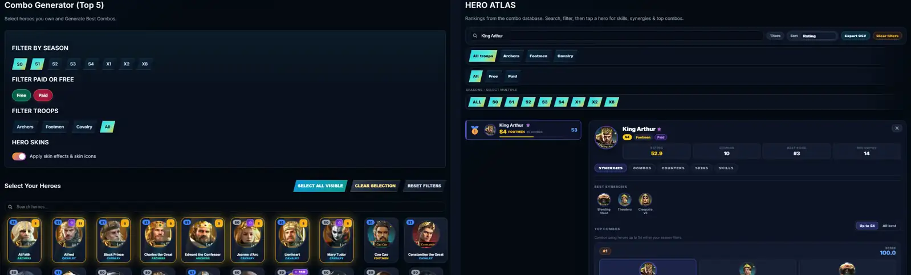
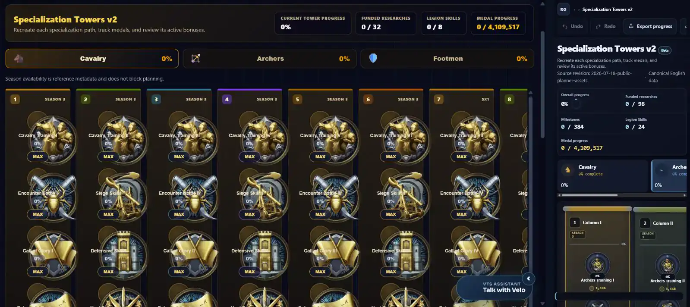

# Hero Combo Creator - VTS 1097 (v14.1.20)

A comprehensive community toolkit for **Rise of Castles: Ice & Fire**, built for VTS State 1097. Combines hero combo building, troop battle simulation, Eden map planning, Dragon Master material planning, tech research tracking, loyalty math, OCR attack analysis, and roster management.

## Features

Fourteen top-level tools are exposed from the main navigation in `index.html`, with `eden-x1.html` kept as a separate public Eden X1 rewards view. This table should stay 1:1 with the deployed UI.

| Tool                      | Source files                                                                                                                                                                                                                     | Purpose                                                                                                                                                                                                                                      | Dependencies                                                                                                                | Perf notes                                                                                                 |
| ------------------------- | -------------------------------------------------------------------------------------------------------------------------------------------------------------------------------------------------------------------------------- | -------------------------------------------------------------------------------------------------------------------------------------------------------------------------------------------------------------------------------------------- | --------------------------------------------------------------------------------------------------------------------------- | ---------------------------------------------------------------------------------------------------------- |
| **Manual Builder**        | `js/app-builder.js`, `js/app-export.js`, `js/combos-db.js`, `js/combo-share.js`                                                                                                                                                  | Drag-drop 3-hero combos; save to `users/{uid}/bestCombos`; export image/text                                                                                                                                                                 | Firestore, html2canvas                                                                                                      | Save = owner-gated Firestore write                                                                         |
| **Combo Generator**       | `js/app-generator.js`, `js/combos-db.js`, `js/hero-bonuses.js`, `js/combo-counters.js`, `js/skins-db.js`, `js/skin-heroes-data.js`                                                                                               | Select owned heroes -> top-5 ranked combos, no overlap; "Surprise Me" random; skin mode                                                                                                                                                      | Hero, combo, counter, and skin datasets                                                                                     | Pure client-side ranking                                                                                   |
| **Hero Atlas**            | `js/app-hero-atlas.js`, `js/heroes-info.js`, `js/heroes-data.js`, `js/skins-db.js`, `js/skin-heroes-data.js`, `js/hero-bonuses.js`                                                                                               | 68+ heroes DB; search/filter; skills, synergies, counters, top combos; seasonal filters; adjustable bonuses                                                                                                                                  | Static hero, combo, counter, and skin data                                                                                  | New badge; dynamically imported                                                                            |
| **Tech Research**         | `js/app-research.js`, `js/tech-db.js`, `js/research-buffs.js`, `js/research-advanced.js`, `js/research-node-icons.js`                                                                                                            | Responsive academy catalog and dependency-tree planner for S0-X8, with resource summaries, progress, MAX actions, and viewport calculator                                                                                                    | Static research data                                                                                                        | Dynamically imported; `tech-db.js` stays in its own data chunk                                             |
| **DM Materials**          | `js/material-calculator.js`, `js/material-planner-model.js`, `assets/dm/`                                                                                                                                                        | Six-piece Dragon Master Command Center: compare direct Gold, recommended Purple, and Blue routes; track owned materials; build normal troop gear; merge tiers; save/export/share plans                                                       | Verified crafting constants and extracted in-game item art                                                                  | Dynamically imported; mobile-first horizontal route/slot flow                                              |
| **Eden Map**              | `tabs/eden-map.html`, `js/eden-map.js`, `js/eden-map-*.js`, `js/eden-datasets-loader.js`, `database/`                                                                                                                            | Canvas 1700x1600 tile map; scout mode; route planning; layer toggles; <=4 teams; terrain-aware distance                                                                                                                                      | Static datasets in `database/`                                                                                              | Lazy-loaded tab via `data-tab-src` and dynamic import                                                      |
| **Strife over Dragon**    | `js/app-strife.js`, `js/strife-db.js`, `js/combos-db.js`, `js/heroes-data.js`                                                                                                                                                    | Monster matchup recommendations intentionally capped to S0-S4 and X1-X2                                                                                                                                                                      | Static data                                                                                                                 | New badge; dynamically imported; X3+ is outside this tool's contract                                       |
| **Eden Loyalty**          | `tabs/loyalty.html`, `js/loyalty-calculator.js`                                                                                                                                                                                  | Poison mitigation, camp presets, deficit/surplus                                                                                                                                                                                             | None                                                                                                                        | Lazy-loaded tab via `data-tab-src`                                                                         |
| **YouTube**               | `js/youtube-v14.js`, `css/youtube-v14.css`                                                                                                                                                                                       | Featured VTS video plus three selectable playlists with direct YouTube fallbacks                                                                                                                                                             | YouTube IFrame                                                                                                              | No iframe is created until the member explicitly presses Load/Watch                                        |
| **Arcade**                | `arcade.html`, `js/arcade.js`, `css/arcade.css`, `games/boot/`                                                                                                                                                                   | Standalone member lobby for Merge Rush, Sort the Hoard, Crystal Relay, Set Assembly, and Hero Rumble                                                                                                                                         | Shared static game shell plus existing DM, wing, logo, and hero-skin art                                                    | Separate page; game code loads only after opening a game                                                   |
| **All-Star BoH**          | `tabs/all-star-boh.html`, `js/all-star-boh-*.js`, `css/all-star-boh.css`, `functions/`, `workers/qwen-cors-proxy.js`                                                                                                             | VTS-only signup with fieldable heroes, research percentages, fighting-time/role/team-fit signals, reviewed stat OCR, six balanced 12-player teams, personal four-phase Legion plans, and independent Epic Showdown preferences               | Firebase Auth/App Check/Firestore/Functions and the secured Qwen OCR Worker                                                 | PIN gate and feature modules load only when the internal tab opens                                         |
| **Specialization Towers** | `js/app-specialization.js`, `js/specialization-towers-v2-*.js`, `js/i18n/specialization-towers-v2/`, `css/app.css`                                                                                                               | Complete Cavalry, Archer, and Footman planner: 32 researches, 718 attribute nodes, 384 milestone buffs, 17 passive skills, all 24 Legion Skills, medal tracking, import/export, and community value entry                                    | Public planner corpus with locally embedded, provenance-checked emblems; browser-local progress                             | Dynamically imported only when the `#specialization` tab opens                                             |
| **Battle Simulator**      | `battle-simulator.html`, `js/battle-simulator-*.js`, `css/battle-simulator.css`                                                                                                                                                  | PIN-gated deterministic troop-combat Beta with point × percentage stat math, independent T9/T10 rows, Research/manual/final-total source breakdowns, whole-legion equipment loadouts, seeded batches, round logs, and JSON/CSV/debug exports | Static T9/T10 presets, browser-local Research progress, fail-closed equipment catalog, and shared client-side beta PIN gate | Standalone page; localized gate loads first, protected app loads after PIN, and large batches use a worker |
| **VTS Admin**             | `admin.html`, `tabs/admin.html`, `js/admin-page.js`, `js/ocr-dashboard.js`, `js/ocr-*.js`, `js/admin-alliance-view.js`, `js/admin-all-star-boh.js`, `js/alliance-view-*.js`, `js/admin-log-*.js`, `js/contribution-weighting.js` | OCR attack analysis, roster and contribution tools, Alliance View, the All-Star BoH command center, exports, Eden X1 voting, conduct adjustments, and cross-device Admin Activity                                                            | Cloudflare Worker (Qwen VL OCR), Firebase Auth/Firestore, reCAPTCHA Enterprise App Check                                    | Seasonal badge; standalone `noindex,nofollow` page                                                         |

**Separate view:** `eden-x1.html` uses `js/eden-x1.js`, `js/eden-vote-deadline.js`, `css/eden-x1.css`, `js/contribution-weighting.js`, and `js/consistency-score.js` for the public Eden X1 weighted contribution dashboard, reward flow, and team-player vote flow. In Eden X1 Votes, admins choose whether Extended or Base Total Contribution is authoritative for the Top 10 -> R4 / Management -> Team Players chain; the public table can compare both formulas without changing assignments. Admins can also schedule an optional voting deadline; the public view exposes an accessible live countdown and blocks expired submissions. It is also `noindex,nofollow`.

**Cross-cutting sub-systems:** `bug-widget.js` + `app-error-reporting.js` (error queue -> `errors` collection), `pwa-register.js` (service worker), `game-time.js` (global game clock), `command-palette.js` (offline Ctrl/Cmd+K tool navigation), `app-undo.js`, `app-shortcuts.js`, `player-tags.js`/`player-registry.js`/`player-profile.js` (roster identity), `roster-share.js`, and `user-data-portability.js` (local data export).

**Performance posture:** Vite build with hashed production assets, manual chunks for large feature/data modules, dynamic `import()` per heavy tab and language pack, preloaded boot wing images and Google Fonts, Google Fonts print-to-all media swap, user-triggered YouTube iframe creation, staged Eden/Admin rendering, lazy exact DM item art, mobile CSS loaded only at `max-width: 768px`, lazy/async footer imagery, `requestIdleCallback` for non-critical work, `--tap-min: 44px` touch sizing, and `env(safe-area-inset-*)` support for notches.

## Operational Communications

R5 Viber posts, in-game mail, and alliance/guild announcements use a separate operational record
from Velo's public strategy knowledge:

- [`docs/r5-communications-guide.md`](docs/r5-communications-guide.md) defines MalakAbo's working
  R5 voice profile, required facts, send criteria, channel formats, approval flow, and translation
  rules.
- [`docs/r5-message-log.md`](docs/r5-message-log.md) is the append-only ledger for requested,
  drafted, approved, sent, corrected, or cancelled message versions.

Time-sensitive orders, private leadership details, player matters, and raw operational chat must not
be copied into Velo's reusable guide dataset.

## Screenshots And Demos

Current screenshot captures live in `docs/media/` and should be refreshed when a major UI flow changes. These previews are captured in dark mode from the local app with demo data where needed.

<table>
  <tr>
    <td colspan="2">
      <strong>Combo Generator and Hero Atlas</strong><br>
      
    </td>
  </tr>
  <tr>
    <td colspan="2">
      <strong>Specialization Towers · Responsive desktop and mobile views</strong><br>
      
    </td>
  </tr>
</table>

Short GIFs are welcome for workflows that static screenshots cannot show well, especially OCR upload parsing and Eden route planning. Keep media optimized before committing so the GitHub Pages branch stays light.

## Specialization Towers Data

The Specialization tool uses the public ROCAcademy planner corpus from
[`tools.riseofcastles.net`](https://tools.riseofcastles.net/specialization-tower-planner/). The
canonical dataset currently covers:

- 32 research badges across eight columns, reused by Cavalry, Archers, and Footmen.
- 718 attribute nodes with canonical English names and buff text.
- 384 exact 25/50/75/100% milestone records and 17 passive skill nodes.
- 24 troop-specific Legion Skills with their full public descriptions.
- 33 public research and Legion Skill emblems, optimized to WebP and embedded locally so the tool
  makes no runtime request to the source site.

Source provenance is recorded in `SPECIALIZATION_SOURCE_METADATA`, including the public planner
JavaScript SHA-256. Per-emblem source URLs, PNG hashes, dimensions, optimized hashes, and byte sizes
live in `tests/fixtures/specialization-planner-assets.json`. The embedded browser assets are in
`js/specialization-towers-v2-assets.js`.

Known prerequisite edges are enforced. When the public corpus confirms every node and buff but not
the dependency path—as with Enhanced Tactics IV—the planner exposes the complete catalog without
inventing edges. Unknown node-level medal costs remain unknown instead of being estimated from the
research total.

Progress is stored under `vts_specialization_towers_v2`. The standalone
`specialization-towers.html` route supports JSON import/export and contribution CSV debugging; the
main site loads its integrated renderer only when the Specialization tab opens.

## Quick Start

```bash
npm ci
npm run dev      # Vite dev server (hot-reload)
npm run build    # Production build -> dist/
npm run preview  # Preview production build
```

## Release Checks

Run the full local gate before shipping:

```bash
npm run check
```

That runs version consistency, lint, Prettier checks, unit tests, i18n validation, a production build, complete-artifact size budgets, and Playwright smoke tests. Every release must pass the full local gate before shipping.

For normal additive releases, a green `npm run check` is enough before committing, pushing, and
opening the PR. Use the optional Firebase Hosting preview only for a major version upgrade, broad
overhaul, or change that explicitly needs Firebase-hosted validation:

```bash
npm run firebase:preview
```

The optional preview reruns `npm run check`, deploys Hosting-only to a versioned seven-day preview
channel, and runs the production smoke suite against the returned URL. The preview uses the real
`abocombo` backend, and automated smoke initializes anonymous Auth and Analytics without
intentional Firestore writes. Keep additional QA read-only unless production writes are
deliberately in scope. Production still ships only through the reviewed `gh-pages` pull request. See
[`docs/firebase-preview-workflow.md`](docs/firebase-preview-workflow.md) for details.

Version cadence: patch releases run through `.20` before the next minor. For the v14 train, ship `14.0.0`, `14.0.1`, ... `14.0.20`; the next release after that is `14.1.0`.

## Tech Stack

| Layer        | Choice                                                                                                                                      |
| ------------ | ------------------------------------------------------------------------------------------------------------------------------------------- |
| **Language** | Vanilla JavaScript (ES6 modules), no framework                                                                                              |
| **Bundler**  | Vite 6 (dev server + build)                                                                                                                 |
| **CSS**      | Custom `app.css`, responsive `mobile.css`, `atmosphere.css` (press/lift/tilt/skeleton/morph utility classes), and semantic `components.css` |
| **Backend**  | Firebase Firestore loaded through pinned browser modules (saved combos, public data, roster sync)                                           |
| **Auth**     | Firebase anonymous auth for public tools; Firebase Email/Password admin login with an admin custom claim for dashboard writes               |
| **OCR**      | Qwen VL API via Cloudflare Worker proxy                                                                                                     |
| **Maps**     | HTML Canvas (Eden Map)                                                                                                                      |
| **Export**   | html2canvas (image), CSV, JSON                                                                                                              |
| **Hosting**  | GitHub Pages (Actions uploads the verified `dist/` artifact from `gh-pages`)                                                                |

## File Structure

```
index.html              Main SPA shell (v14 navigation and primary tool surfaces)
admin.html              Standalone VTS Admin shell
eden-x1.html            Separate Eden X1 public contribution/rewards view
battle-simulator.html   PIN-gated Battle Simulator Beta
specialization-towers.html  Standalone Specialization Towers planner
vite.config.js          Vite build config (manual chunking)
scripts/post-build.mjs  Post-build: copy static assets to dist/ and generate the precache manifest
public/
  sw.js                 Service worker
  404.html              404 fallback page
workers/
  qwen-cors-proxy.js    Cloudflare Worker: Qwen API proxy
tabs/
  admin.html            VTS Admin template (fetched by admin.html)
  eden-map.html         Eden Map tab template (lazy-loaded)
  loyalty.html          Eden Loyalty tab template (lazy-loaded)
database/
  eden-datasets.manifest.json  Eden dataset catalog
  Eden_*.txt                   Source map datasets
  eden-wonders-screenshots/    Extracted sector data
scripts/eden/
  build-eden-datasets.py       Generate encoded Eden dataset payload
  build-eden-from-screenshots.py  Rebuild X1 dataset from screenshots
  build-eden-x12.py            Rebuild X12 reference dataset
  (and more Python tools for Eden data)

css/
  _tokens.css           Shared design tokens, spacing scale, reduced-motion base
  app.css               All styles (~6100 lines)
  atmosphere.css        Utility-first design system (press, lift, tilt, skeleton, morph, burst, aura)
  components.css        Reusable component styles (cards, tabs, pills, modals)
  shell-v14.css         Compact aurora/glass shell, desktop rail, mobile 4+More navigation
  materials.css         Dragon Master Command Center
  research-v14.css      Research catalog and dependency-tree presentation
  youtube-v14.css       Deferred featured-video and playlist rail
  secondary-tools-v14.css Scoped Strife, Loyalty, and Eden Map responsive polish
  eden-x1.css           Eden X1 public view styles
  mobile.css            Mobile responsive overrides
  ocr-dashboard.css     Admin dashboard styles

js/
  app.js                Core: tabs, theme, event wiring, error boundaries
  app-builder.js        Manual combo builder: drag-drop, slots, save
  app-generator.js      Combo generator: best & random modes
  app-hero-atlas.js     Hero Atlas tab: search, skills, synergies, skins
  app-research.js       Tech Research Calculator tab
  app-specialization.js Integrated Specialization Towers tab renderer
  specialization-towers-v2-assets.js  Optimized embedded public planner emblems
  specialization-towers-v2-data.js    Canonical researches, nodes, buffs, milestones, and Legion Skills
  specialization-towers-v2-model.js   Progress, prerequisites, medal totals, and unlock calculations
  material-calculator.js Dragon Master Command Center renderer
  material-planner-model.js Dragon Master routes, recipes, plan validation/share model
  shell-v14.js          Responsive app-shell navigation and More sheet
  youtube-v14.js        On-demand YouTube playlist/player controller
  app-strife.js         Strife over Dragon recommendations
  app-export.js         Export functions (html2canvas, CSV, text)
  app-error-reporting.js  Client error queue and Firestore flush
  app-hero-tooltip.js   Hero tooltip hover logic
  app-loading.js        Boot splash (3D door animation), loading progress
  app-shortcuts.js      Keyboard shortcuts
  app-undo.js           Undo toast stack
  bug-widget.js         User-facing bug report widget

  state.js              Shared state: combo rank info, filters, troop colors
  utils.js              escapeHtml, helpers
  seo.js                JSON-LD schema, meta optimization

  skins-db.js           Skin database schema + hero skin entries
  combos-db.js          Ranked combo database (180 entries)
  strife-db.js          Strife over Dragon recommendation data
  combo-counters.js     Counter matchups + render
  combo-counter-lookup.js  Search: which heroes counter which
  combo-share.js        URL share for combos
  roster-share.js       URL share for rosters

  heroes-data.js        Hero base data (68 heroes: name, season, troop, state)
  heroes-info.js        Hero skills, placement, copies
  hero-bonuses.js       Manual rating adjustments

  firebase.js           Firebase init, anonymous auth, getDb
  player-profile.js     Cloud profile save/load
  player-registry.js    Canonical roster/player identity helpers
  player-tags.js        Special player tag rendering
  pwa-register.js       Service worker registration + install prompt
  game-time.js          Game clock display, sync titles
  translations.js       Default English i18n loader + dynamic language imports
  user-data-portability.js  Local data export helpers
  i18n/                 Per-language modules loaded on demand

  tech-db.js            Tech tree database
  research-node-icons.js    SVG icons for tech nodes
  research-advanced.js  Advanced research view
  research-buffs.js     Research buff summaries and missing-value checks
  loyalty-calculator.js Eden loyalty calculator

  admin-page.js         Standalone admin shell bootstrap
  contribution-weighting.js  Eden contribution scoring helpers
  consistency-score.js  Eden X1 consistency scoring helpers
  eden-x1.js            Eden X1 public dashboard and voting logic
  eden-vote-deadline.js Shared voting-deadline normalization and countdown model
  ocr-dashboard.js      VTS Admin: main dashboard logic
  ocr-roster.js         Roster: checklist, login, alliances, snapshots
  ocr-render.js         Dashboard UI rendering
  ocr-engine.js         OCR parsing logic (structure names, durability)
  ocr-name-normalizer.js OCR/player name cleanup
  ocr-shared.js         Shared constants, state, helpers for OCR module
  ocr-time-filter.js    Game-time filtering helpers
  ocr-adjustments.js    R5 Bonus Team Effort Points panel: merit/penalty points, Firestore sync
  admin-log-store.js    Local bounded Admin Activity ring/outbox/deduplication
  admin-log-sync.js     Admin-only cross-device Firestore Activity stream

  eden-map.js           Eden Map: render, plans, routing
  eden-map-data.js      Static data, sector definitions
  eden-map-assets.js    Image preloading, icon management
  eden-map-terrain.js   Terrain layer, pathfinding
  eden-map-ui.js        UI controls, toolbars
  eden-map-features.js  Structure features, filters
  eden-map-guide.js     Help overlay
  eden-map-season.js    Season picker
  eden-map-teams.js     Team management
  eden-map-sidebar.js   Sidebar panel helpers
  eden-map-toolbar.js   Toolbar rendering/actions
  eden-map-scout.js     Scout report overlay
  eden-map-construction.js  Construction timeline
  eden-map-config.js    Constants
  eden-datasets.payload.json  Encoded Eden structure dataset payload
  eden-datasets-loader.js   Runtime decoder
  eden-live-map.js      Live map overlay
  eden-tooltips.js      Eden hover tooltips (i18n)
```

## Key Architecture Decisions

### Deployment Model

The `gh-pages` branch is the production source branch, but Pages does not serve its files directly. GitHub Actions runs the full deploy verification, uploads `dist/` as the Pages artifact, and deploys only that verified artifact.

### CSS Architecture

The app no longer ships the frozen Tailwind compatibility shim. Remaining UI styling lives in semantic stylesheets (`app.css`, `components.css`, `mobile.css`, and `atmosphere.css`), and `cssnano` minifies production CSS after the Vite build.

### Tab Lazy-Loading

Eden Map and Loyalty tab templates are fetched on first tab click via `loadTabTemplate()`. Manual Builder, Arcade, Research, Hero Atlas, Strife over Dragon, Eden Map code, OCR dashboard code, image export, hero-info data, and language packs are loaded with dynamic `import()` so first paint avoids the biggest optional modules. VTS Admin and Eden X1 are standalone pages with their own Vite inputs.

### Release Mode

`js/maintenance-config.js` remains the explicit release/maintenance toggle and is included in the service-worker precache. While `VTS_MAINTENANCE_MODE` is enabled, every public entry page redirects to the lightweight maintenance page unless the local/session bypass is present.

### Admin Auth

The public toolkit still uses Firebase anonymous auth for saved combos and public data. The standalone VTS Admin dashboard uses a shared Firebase Email/Password account: username `1097` maps to `1097@abocombo.web.app` via `AUTH_EMAIL_DOMAIN`.

Admin dashboard writes to `vts_admin/dashboard_data`, `vts_admin/roster_data`, and `vts_admin/conduct_adjustments/records` require the signed-in Firebase user to have an `admin: true` custom claim. The shared `1097` Email/Password account can still be the team login, but that account's UID must carry the admin claim before Firestore writes will pass. Anonymous users can read shared admin data where the rules allow it, but they cannot overwrite OCR, roster, banner, pather, contribution, or R5 Bonus Team Effort records.

The dashboard saves OCR results to localStorage first, then uploads to Firestore when cloud sync is available. Failed cloud writes must stay visible in the admin status/log instead of looking like a successful sync. On load, locally cached attacks are merged with cloud attacks by attack id and written back to Firestore when the signed-in admin session can write.

To grant the shared admin account the custom claim, use the account email or copy that user's UID from Firebase Authentication and run:

```bash
$env:FIREBASE_ADMIN_EMAIL="1097@abocombo.web.app"
# or: $env:FIREBASE_ADMIN_UID="the-auth-uid"
$env:FIREBASE_SERVICE_ACCOUNT_PATH="C:\path\to\service-account.json"
npm run firebase:admin-claim
```

After setting the claim, reload the site so Firebase refreshes the auth token. If cloud writes still fail, check the visible sync banner and the Analysis Terminal for the exact Firestore/App Check/auth error.

### Firebase

Firebase browser modules are loaded through `js/firebase-sdk.js` from the pinned `gstatic` module version (`11.6.1`) so GitHub Pages can serve raw ES modules without bare package specifiers. If Firebase config is missing, public UI paths degrade gracefully and skip anonymous auth instead of blocking startup.

GitHub Pages deployment publishes the static app only; it does not deploy `firestore.rules`. After changing public vote validation or any Firestore write contract, deploy the rules to Firebase before expecting live writes to pass:

```bash
npx firebase-tools deploy --only firestore:rules --project abocombo
```

For Eden X1 Team Players voting, `vts_admin/eden_x1_votes/records` now accepts one to four unique teammate votes per selected voter/member. If live voting shows `Missing or insufficient permissions`, first confirm the latest `firestore.rules` are deployed.

The synchronized Admin Activity stream writes an absolute `expiresAt` timestamp 30 days ahead. Firestore rules validate that timestamp, but deletion starts only after the collection-group TTL policy is enabled separately:

```bash
gcloud firestore fields ttls update expiresAt --collection-group=admin_log_events --enable-ttl --project=abocombo
```

This TTL applies only to `vts_admin/log_store/admin_log_events`; it does not expire dashboard, roster, vote, or user-plan data.

### OCR Worker and App Check

The admin OCR flow calls Qwen through `workers/qwen-cors-proxy.js`. The browser must be served by Vite or a built deployment with `VITE_FIREBASE_API_KEY`, `VITE_FIREBASE_PROJECT_ID`, `VITE_FIREBASE_APP_ID`, and `VITE_RECAPTCHA_SITE_KEY`. The reCAPTCHA Enterprise site key is public and is not the App Check token; Firebase uses it in the browser to mint the short-lived token sent as `X-Firebase-AppCheck`.

Worker configuration uses `DASHSCOPE_API_KEY` as the primary Cloudflare secret. Optional fallback configuration is handled entirely in Cloudflare: set `DASHSCOPE_FALLBACK_API_KEY` if the spare quota is on a second Alibaba key, and set `DASHSCOPE_FALLBACK_MODELS` to a comma-separated list of up to five extra compatible model names. Non-secret Worker variables include `DASHSCOPE_BASE_URL` (default: `https://dashscope-intl.aliyuncs.com/compatible-mode/v1`), `DASHSCOPE_MODEL` (default: `qwen-vl-plus`), `DASHSCOPE_FALLBACK_BASE_URL`, `DASHSCOPE_FALLBACK_MODELS`, `ALLOWED_ORIGINS`, `FIREBASE_APP_CHECK_PROJECT_NUMBER`, and optional `FIREBASE_APP_CHECK_APP_ID`. `FIREBASE_APP_CHECK_APP_ID` is the Firebase Web App ID (`1:...:web:...`), not the reCAPTCHA site key.

The All-Star OCR route uses the `BOH_OCR_RATE_LIMITER` Durable Object declared in `wrangler.jsonc`. One coordinator atomically reserves the hashed Firebase-UID bucket and global bucket, so simultaneous requests cannot both pass a max-one limit and a global rejection does not consume the member allowance. Production mode is `durable` and fails closed with HTTP 503 if the binding is missing or unavailable; isolate-local counters are available only when a unit/local harness explicitly sets `BOH_OCR_RATE_LIMIT_MODE=memory-test`. The legacy generic OCR route can still use an optional `RATE_LIMIT_KV` binding, but that older KV read/write counter is not the All-Star authorization or quota boundary.

All-Star OCR also reads `boh_allstar_member_grants/{uid}` through the Firestore REST API with the caller's already-verified Firebase ID token. The deployed Firestore rule must allow only the member's own GET and must require schema version 1, matching UID, a future `expiresAt`, and `seasonId == boh_allstar_config/current.activeSeason`. The Worker validates the returned Firestore schema again and fails closed on denied, missing, malformed, or unavailable grant reads; it no longer trusts reusable custom claims.

Member-owned planning data stays season-scoped under `boh_allstar/{season}`. Private All-Star signup documents may include canonical fieldable-hero names, sparse `0–100` research-tree percentages, exactly two preferred fighting-time IDs, an optional favorite role, and up to six non-binding teammate names. These fields are leadership planning signals and do not add strength-score points. Epic Showdown choices are revisioned independently in `epicPreferences/{uid}`, so changing lane or time availability never invalidates a reviewed BoH signup. Members with a current grant can read and update only their own preference document; Firebase admins can list the season for planning summaries.

The Worker entry preserves the existing `AI_USER_QUOTA` and `AI_GLOBAL_QUOTA` bindings plus their `ai-quota-v1` migration before appending `v1-boh-ocr-rate-limiter`. The first deployment containing the BoH tag provisions its SQLite-backed Durable Object namespace. Cloudflare Durable Objects therefore need to be available on the target account, and neither migration tag may be renamed, reordered, or removed after deployment. Deploy the additive Firestore grant rules and grant-writing Function before deploying this Worker; no extra Worker secret is needed for the grant read because it runs under the caller's Firebase ID token. `npm run worker:check` validates the bindings and bundle without deploying anything.

Cloudflare Worker deploy checklist:

```bash
npx wrangler login
npm run worker:check
npm run worker:deploy
```

Before deploy, set the Qwen key as a Cloudflare secret:

```bash
npx wrangler secret put DASHSCOPE_API_KEY
```

The checked-in `wrangler.jsonc` is the source of truth for non-secret Worker permissions. It must include `https://roc-vts.com`, `http://localhost:5173`, `http://127.0.0.1:5173`, and any LAN/Vite ports used for phone testing in `ALLOWED_ORIGINS`. Do not deploy with `--keep-vars` when fixing origin drift, because that preserves stale dashboard variables.

For local OCR testing, `.env` may use `VITE_FIREBASE_APPCHECK_DEBUG_TOKEN=true`. The first browser run prints an `App Check debug token`; add that UUID in Firebase Console > App Check > your web app > Manage debug tokens, then replace `true` with the registered UUID and restart Vite. Otherwise Firebase returns HTTP 403 before the OCR Worker receives the request.

If `/status` is ready but uploads fail with `Workers endpoint access denied`, check Cloudflare Worker variables first: `DASHSCOPE_BASE_URL` must be `https://dashscope-intl.aliyuncs.com/compatible-mode/v1`, and `DASHSCOPE_API_KEY` / `DASHSCOPE_FALLBACK_API_KEY` must belong to Alibaba Cloud accounts with DashScope/Qwen VL access. `/status` reports `fallbackModelConfigured` for same-key model fallback, `fallbackKeyConfigured` for a second spare key, plus `primaryModel`, `modelCount`, and `fallbackModelCount` without exposing secret values.

### Error Boundaries

Each module init is wrapped in `safeInit()` so one failing tab doesn't block others. Global `error` and `unhandledrejection` handlers catch last-resort failures. A 5-second loading screen timeout force-dismisses the splash if `notifyAppReady` never fires.

### State Management

Shared state variables (`allHeroesData`, `heroesExtendedData`, `rankedCombos`, etc.) are exported from their respective modules. The `state.js` module provides computed helpers (`getComboRankInfo`, troop color maps, filter logic).

### OCR Module Pattern

The legacy monolithic `ocr-dashboard.js` was split into `ocr-roster.js`, `ocr-render.js`, `ocr-engine.js` with a shared `ocr-shared.js` for constants, state, and utilities (`$id`, `esc`, `log`).

## Data Flow

```
1. Combo Builder
   Select 3 heroes -> updateManualComboScore() -> getComboRankInfo() -> show rank + score + counters

2. Combo Generator
   Select 12+ heroes -> generateBestCombos() -> iterate rankedCombos -> top 5 (no overlap)

3. OCR Roster
   Upload screenshot -> Qwen API -> takeRosterSnapshot() -> localStorage + Firestore -> renderRoster()

4. OCR Attack Data
   Upload structure screenshots -> Qwen API -> save to dashData -> leaderboard + chart + insights

5. Eden Map
   Select season -> render map -> place/remove structures -> plan routes -> share plan
```

## localStorage Keys

| Key                            | Purpose                                                                        |
| ------------------------------ | ------------------------------------------------------------------------------ |
| `vts_ocr_dashboard`            | Attack data JSON                                                               |
| `vts_ocr_auth`                 | Admin password hash                                                            |
| `vts_ocr_roster`               | Legacy flat roster text                                                        |
| `vts_roster_snapshots`         | Roster snapshot array                                                          |
| `vts_roster_alliances`         | Alliance name list                                                             |
| `vts_roster_user`              | Logged-in roster user                                                          |
| `vts_ocr_banners`              | Banner records array                                                           |
| `qwen_api_key`                 | Legacy browser-stored Qwen key; cleared because OCR now uses the Worker secret |
| `vts_generator_owned_skins_v1` | Per-hero skin/base ownership toggles in the combo generator                    |

## Firebase

- **Auth:** Anonymous via `ensureAnonymousAuth()`
- **Firestore paths:**
  - `vts_admin/dashboard_data` -- OCR attack data
  - `vts_admin/roster_data` -- roster snapshots
  - `vts_admin/conduct_adjustments/records` -- R5 Bonus Team Effort Points (admin write only)
  - `vts_saved_combos` -- community shared combos
- **Real-time listeners** via `onSnapshot()` for roster and saved combos
- **Offline-first:** All saves go to localStorage first, then Firestore

## Deploy

The site auto-deploys at **https://roc-vts.com/** when a pull request is merged into `gh-pages` (custom domain configured in repo Settings > Pages).

Because `gh-pages` is production, do not commit or push directly to it. Create a branch from the latest `origin/gh-pages`, open a pull request into `gh-pages`, wait for checks/review, and let the owner merge. See [AGENTS.md](AGENTS.md) for the required agent workflow.

## Contributing

Community data updates are welcome. See [CONTRIBUTING.md](CONTRIBUTING.md) for the preferred formats for hero stats, combo corrections, skin data, OCR examples, and Eden screenshots.

### Combo Dataset Attribution

The optional combo audit tool (`npm run combos:audit`) uses public combo candidate data from [tools.riseofcastles.net/combos-data](https://tools.riseofcastles.net/combos-data/). Credit to the Rise of Castles Tools team/community for publishing and maintaining those datasets. Imported records are treated as review candidates and are not automatically merged into the curated ranking database.

For release bookkeeping, keep [CHANGELOG.md](CHANGELOG.md) updated with every user-visible change.

## Eden Map Data

Dataset JSON is stored in `js/eden-datasets.payload.json`. After updating screenshots or map assets:

```bash
python scripts/eden/build-eden-from-screenshots.py   # X1 from in-game screenshots
python scripts/eden/build-eden-x12.py                # X12 reference baseline
```

Both run `build-eden-datasets.py` to regenerate the payload. Then `npm run build` to rebuild.

## Environment

- Node.js 18+ (for Vite build)
- Python 3.10+ (for Eden dataset scripts)
- A Qwen/DashScope API key stored as the Cloudflare Worker secret `DASHSCOPE_API_KEY`
