<p align="center">
  
</p>

# RoC VTS Toolkit - VTS 1097 (v16.6.15)

**The community toolkit for _Rise of Castles: Ice & Fire_, built by and for State 1097.**
Find your best hero combos, plan research and specialization, prepare for Eden, and run alliance records, all in one place. It works on phones and is available in 13 languages.

<p align="center">
  <a href="https://roc-vts.com"><b>Open the toolkit →</b></a>
  &nbsp;·&nbsp; <a href="CHANGELOG.md">What's new</a>
  &nbsp;·&nbsp; <a href="docs/README.md">Documentation</a>
  &nbsp;·&nbsp; <a href="CONTRIBUTING.md">Contributing</a>
  &nbsp;·&nbsp; <a href="SECURITY.md">Security</a>
</p>

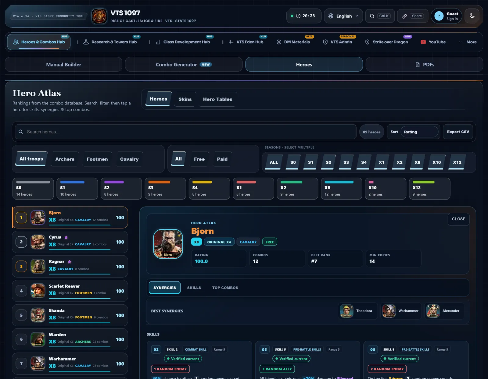

## Heroes and combos

<table>
  <tr>
    <td colspan="2">
      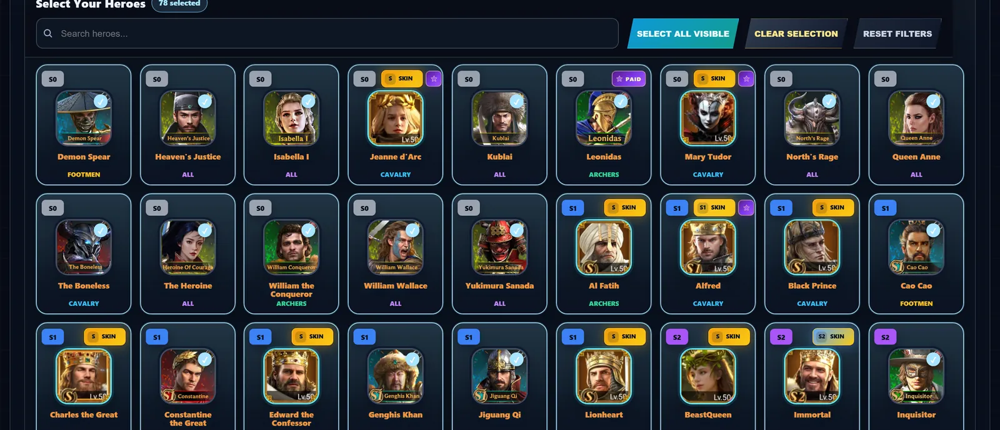
      <h4>Your roster, one tap per hero</h4>
      Every hero from S0 to X12, with skin art and season tags. Pick the ones you own and let the generator do the rest, or use <b>Manual Builder</b> to check one specific lineup's rating and counters.
    </td>
  </tr>
  <tr>
    <td width="50%" valign="top">
      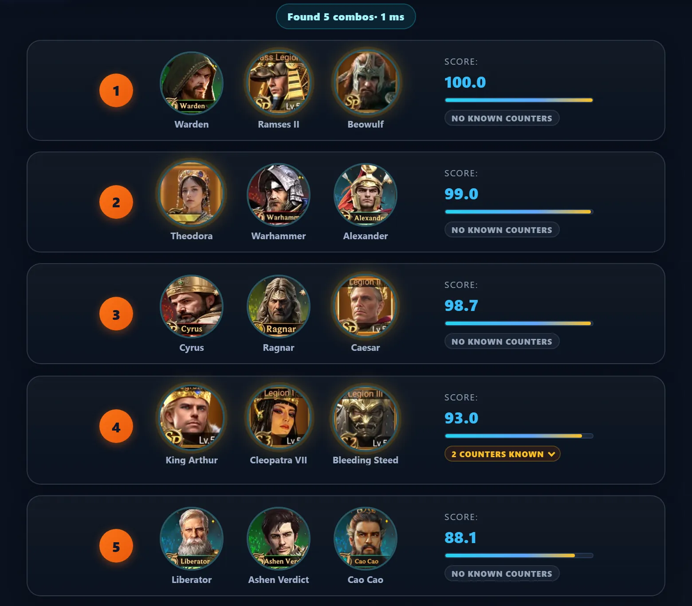
      <h4>Combo Generator</h4>
      The best three-hero lineups from your roster, ranked and scored, with known counters flagged. Season, free/paid and troop filters narrow the pool. Results can be shared or downloaded as an image.
    </td>
    <td width="50%" valign="top">
      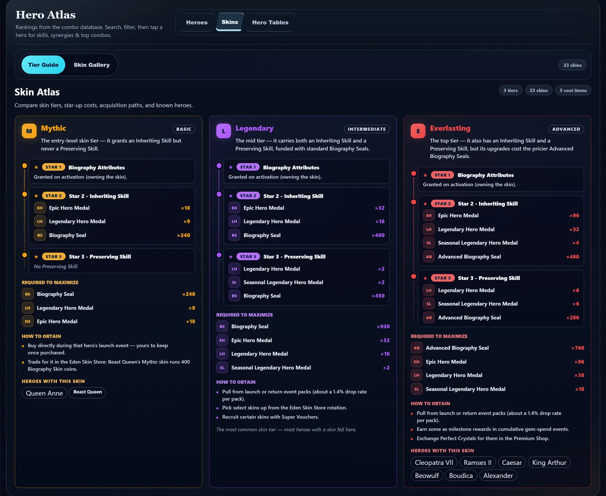
      <h4>Hero Atlas and Skin Atlas</h4>
      Search and sort all heroes, open one for skills, synergies and top combos, and compare skin tiers, star-up costs and where to get them.
    </td>
  </tr>
</table>

## Research and specialization

<table>
  <tr>
    <td width="50%" valign="top">
      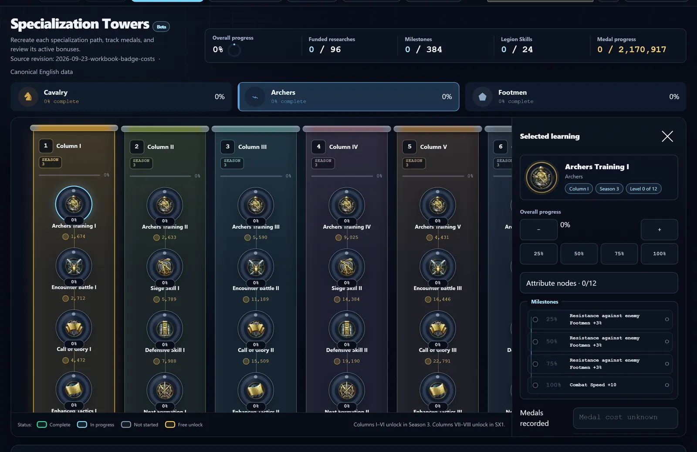
      <h4>Specialization Towers</h4>
      Rebuild each troop's specialization path node by node, track medals and milestones, and see the bonuses you've unlocked. Progress exports and imports.
    </td>
    <td width="50%" valign="top">
      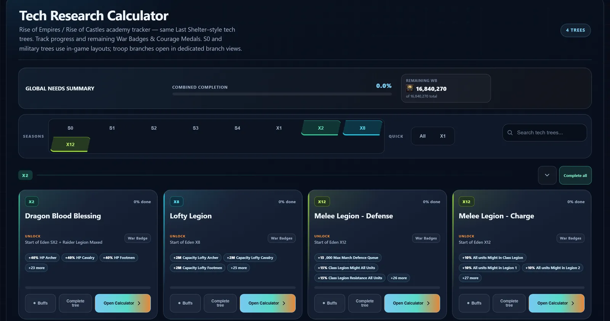
      <h4>Tech Research Calculator</h4>
      Plan research trees season by season, with total costs and remaining War Badges and Courage Medals. Also in this hub: the <b>Sword of Judgment</b> artifact tree and building upgrades.
    </td>
  </tr>
</table>

## Battles, Eden and the Arcade

<table>
  <tr>
    <td width="50%" valign="top">
      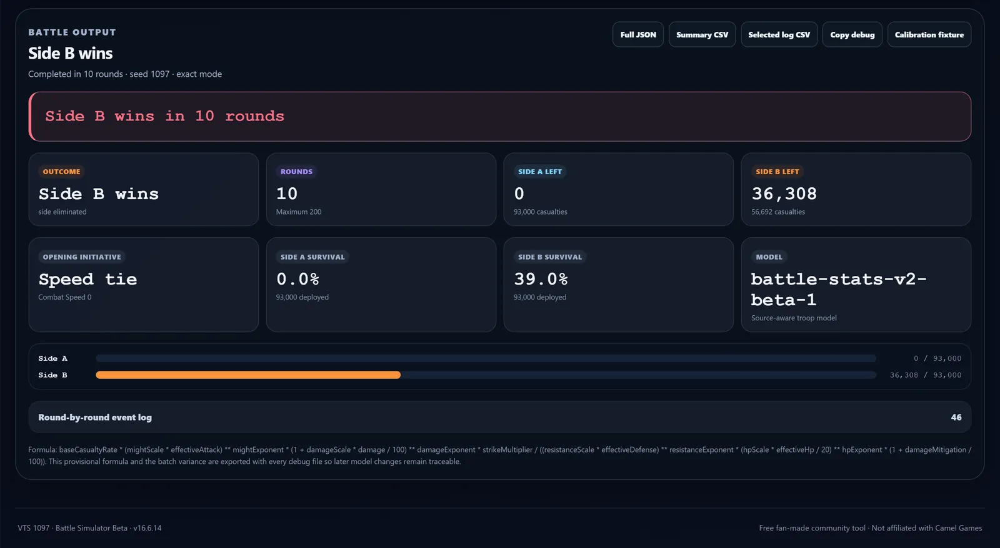
      <h4>Battle Simulator <sup>beta</sup></h4>
      Set up two three-row formations and run one exact battle or a seeded batch. Every result shows which stats it used, and missing values are named rather than guessed.
      <br /><br />
      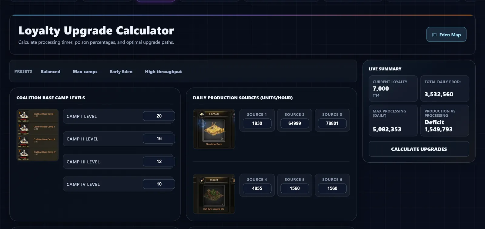
      <h4>VTS Eden hub</h4>
      Loyalty upgrades, Royal Bounty, the Eden map, the playbook, and contribution rankings for the current and previous seasons.
    </td>
    <td width="50%" valign="top">
      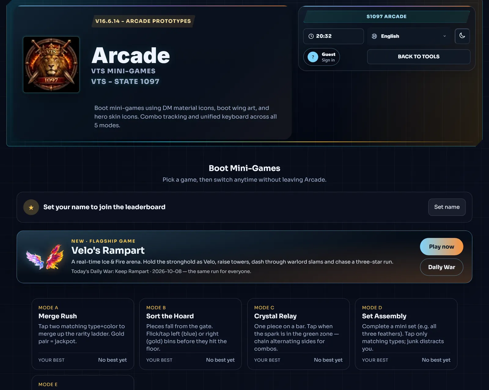
      <h4>Arcade</h4>
      <b>Velo's Rampart</b>, a real-time tower-defense game with a Daily War, plus five quick mini-games with a shared leaderboard.
    </td>
  </tr>
</table>

## Made for phones

<table>
  <tr>
    <td width="33%">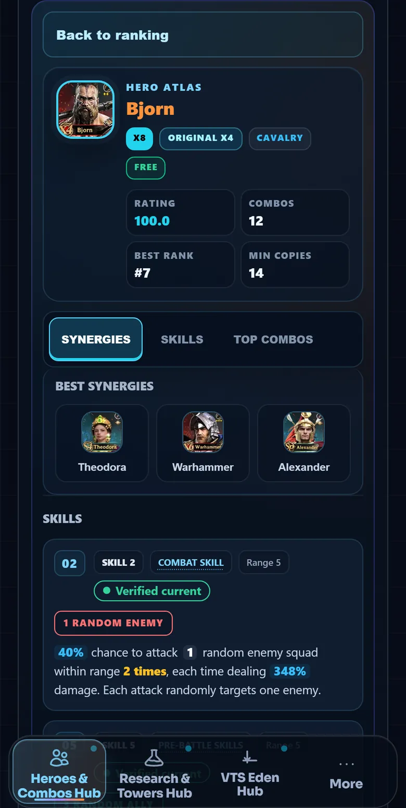</td>
    <td width="33%">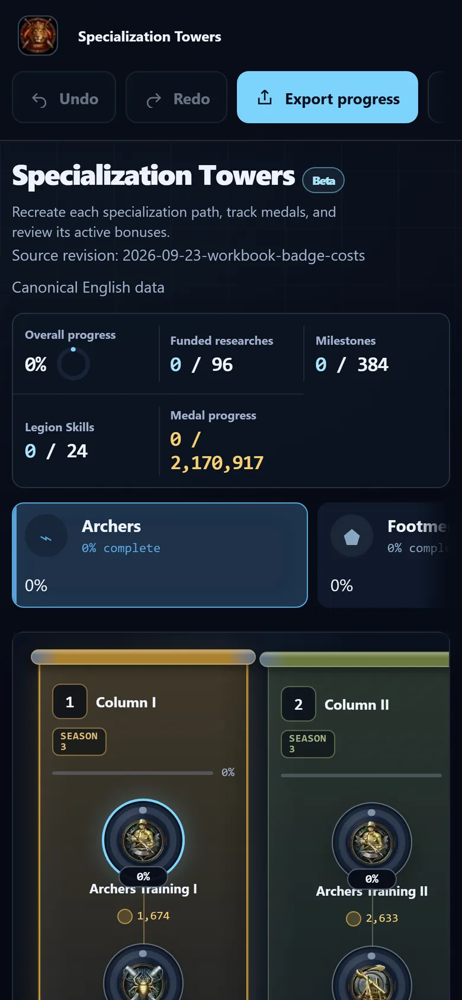</td>
    <td valign="top">
      Every tool is designed for phones as well as desktop. Secondary tools live under <b>More</b>, and <kbd>Ctrl</kbd>/<kbd>⌘</kbd>+<kbd>K</kbd> opens the command palette on desktop.
      <br /><br />
      Light and dark themes · 13 languages (English, Arabic, Spanish, Portuguese, French, German, Croatian, Indonesian, Italian, Korean, Russian, Turkish, Chinese) · <b>Velo</b>, the built-in assistant
    </td>
  </tr>
</table>

## Everything else in the toolkit

| Tool                   | What it's for                                                                            |
| ---------------------- | ---------------------------------------------------------------------------------------- |
| **DM Materials**       | Dragon Master set planning: crafting routes, material totals and enhancement milestones  |
| **Class Development**  | Class leveling paths with skill priorities at each checkpoint                            |
| **Strife over Dragon** | Hero recommendations for Strife (S0–S4, X1–X2)                                           |
| **PDFs**               | 14 printable references: heroes, combos, skins, research, towers, Eden and Dragon Master |
| **VtsScore**           | Competition sign-ups, growth uploads and the growth board, unlocked with the member PIN  |
| **VTS Admin**          | Leadership tools: OCR leaderboards, roster, contributions, match results and roles       |

Member and admin tools need the right sign-in; opening a page doesn't grant access.

### About the data

- Hero, skill and research facts carry their source and verification status. Unknown values are left blank, never guessed. To correct something, see [data and evidence](CONTRIBUTING.md#data-and-evidence) and the [source package](docs/sources/x10-x12/README.md).
- Battle Simulator results are model output, not a guarantee of in-game outcomes.
- The artifact view currently covers **Sword of Judgment** only.

---

## For contributors

**gh-pages is production, and every change goes through a pull request.** [AGENTS.md](AGENTS.md) is the authoritative workflow and release policy.

### Quick start

Requires **Node 22** ([.nvmrc](.nvmrc)) and Python 3.11, the same as CI.

```powershell
git fetch origin
git worktree add -b my-change ../hero-combo-my-change origin/gh-pages
cd ../hero-combo-my-change
npm ci
npm run dev
```

Use the URL Vite prints; don't open `index.html` from disk. Always `npm ci`, because a `node_modules` folder left over from another branch causes misleading size failures. Public pages run without credentials. For cloud features, copy [.env.example](.env.example) to `.env.local` and run `npm run dev -- --host 127.0.0.1 --port 5174`. Never commit credentials, PINs or debug tokens.

### Everyday commands

| Command              | Does                                                                          |
| -------------------- | ----------------------------------------------------------------------------- |
| `npm run dev`        | Development server                                                            |
| `npm run check:fast` | Version, lint, formatting, unit tests and translations: the usual pre-PR gate |
| `npm run test:unit`  | Node unit suite only                                                          |
| `npm run build`      | Production build (also refreshes generated stamps and payloads)               |
| `npm run size:check` | Asset budgets against a fresh build                                           |
| `npm run check`      | Full gate including rules, build, size and browser smoke tests                |

Browser tests need Chromium once: `npx playwright install chromium`.

### Where things live

| Path                     | Contents                                                       |
| ------------------------ | -------------------------------------------------------------- |
| `*.html`, `tabs/`        | Page entry points and lazily fetched tab templates             |
| `js/`, `css/`            | Feature code, models, catalogs, translations and styles        |
| `database/`              | Canonical source tables and evidence used by the data builders |
| `functions/`, `workers/` | Firebase Functions and the OCR/AI proxy (deployed separately)  |
| `scripts/`, `tests/`     | Build and validation tooling, unit and browser tests           |
| `docs/`                  | Guides, source evidence and historical plans                   |

[Architecture](docs/architecture.md) covers feature ownership, data paths and caching. [Operations](docs/operations.md) covers troubleshooting.

### Releasing

- User-visible changes bump the version and add a [CHANGELOG](CHANGELOG.md) entry. Patch releases run to .20 before the next minor.
- Small fixes need focused tests plus `check:fast`. Security, auth, Firebase rules and major upgrades need the full `npm run check`.
- Firebase rules, Functions and Workers deploy separately from the site; see the [deploy runbook](docs/firebase-deploy-runbook.md). Merging a PR does not deploy them.
- The owner merges. See the [release guide](docs/version-control-workflow.md).

README screenshots are captured from the live site with demo-safe public pages and stored in `docs/media/readme/`.

## Support

Report bugs with the page, release, language, theme, device and steps to reproduce. Data corrections need a source. See [CONTRIBUTING.md](CONTRIBUTING.md). Report security or private-data issues privately via [SECURITY.md](SECURITY.md), never in a public issue.

Licensed under the terms in [LICENSE](LICENSE). This is a free fan-made tool, not affiliated with Camel Games or Rise of Castles.
